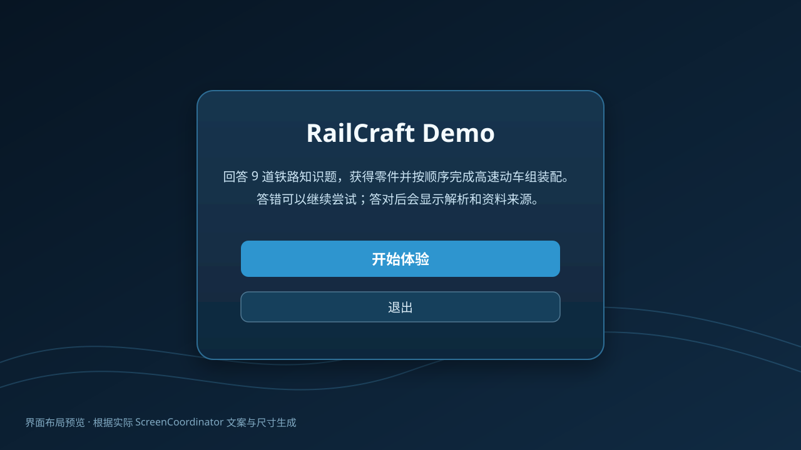

# RailCraft Demo

RailCraft Demo 是一个使用 Godot 4.6.3 制作的铁路知识答题与列车装配教学 Demo。玩家依次完成 9 道铁路知识单选题，每题答对后获得一个零件，并在固定 3D 视角中完成点击吸附装配。9 个零件组成 3 个系统级组件，最终形成一列原创通用高速电力动车组教学模型。

## 发布状态

`v0.1.0-demo` 首版功能与交付内容已经完成：

- 数据驱动的 9 道题、9 个零件、3 个组件和整车配方；
- 错误重试、正确答案解析及来源显示；
- 答题、奖励、顺序安装和完整状态机；
- 9 个可替换的 Godot 原生低多边形零件；
- 零件吸附、组件反馈和整车完成动画；
- 开始页、答题页、装配 HUD、组件覆盖层、结束页和致命错误页；
- 内容校验、资产契约校验、107 个自动化测试和主场景冒烟测试；
- 固定版本的格式检查、lint、GitHub Actions 与 Windows x64 导出流程；
- Windows 20 项验收记录与最终发布候选摘要。

完整验收结果见 [`doc/acceptance/windows-v0.1.0-demo.md`](doc/acceptance/windows-v0.1.0-demo.md)，版本说明见 [`doc/releases/v0.1.0-demo.md`](doc/releases/v0.1.0-demo.md)。

## 界面预览



> 上图根据实际 `ScreenCoordinator` 尺寸、颜色、文案和控件层级生成，用于仓库文档预览。正式运行画面以 Windows 构建为准。

## 快速开始

### 使用 Windows 构建

1. 从 Build Windows workflow 的 `RailCraft-Demo-windows-x64` artifact，或 `v0.1.0-demo` Release 附件下载压缩包。
2. 将压缩包完整解压到本地目录。
3. 双击运行：

```text
RailCraft-Demo.exe
```

程序完全离线运行，不需要账号、网络、数据库或额外运行时。详细步骤与故障排查见 [`doc/running.md`](doc/running.md)。

### 使用 Godot 编辑器

1. 安装 Godot Standard `4.6.3-stable`。
2. 使用 Godot 导入仓库根目录中的 `project.godot`。
3. 运行项目。主场景为 `res://scenes/main/main.tscn`。

## 体验流程

```text
开始页面
→ 选择一道题的答案
→ 回答错误时保留原题并继续作答
→ 回答正确后查看解析与来源
→ 进入装配
→ 点击新获得的零件并播放吸附动画
→ 每 3 个零件完成一个系统级组件
→ 第 9 个零件后播放整车完成动画
→ 完成页面
```

体验过程中没有失败结局。当前题目必须答对后才能继续。

## 最终 Windows 构建校验

对应 Quality run `29680837181` 与 Build Windows run `29680837294`：

- Windows artifact ID：`8440530015`
- Actions artifact SHA-256：`4219532461d317aab78b996d656d822dc78a1e196aa3735b0084372d21ae7be1`
- 内层 Windows ZIP SHA-256：`64536d74501643bbb193eee911939c23c854ddc0cb02f304e5a7d112d2245f41`
- `RailCraft-Demo.exe` SHA-256：`b96aa532a24c4c9d683485a0b3f95e1c2bcdf9e042a5d6f6fabf3e42da482721`
- EXE 大小：`119428664` 字节
- 文件类型：Windows x86-64 GUI PE32+
- Artifact 保留至：2026-08-18

## 开发验证

项目固定使用：

- Godot Standard `4.6.3-stable`；
- GUT `9.6.0`；
- Python `3.12.13`；
- uv `0.11.8`；
- gdtoolkit `4.5.0`；
- pre-commit `4.6.0`。

常用验证命令：

```text
uv sync --frozen
uv run --frozen gdformat --check scripts tests
uv run --frozen gdlint scripts tests
uv run --frozen pre-commit run --all-files
```

Godot headless、GUT 和 Windows 导出命令见 [`doc/development.md`](doc/development.md)。

## 主要目录

```text
data/                   题目、零件和配方数据
scenes/main/            主场景
scenes/assembly/        装配视图和 PartActor 基础场景
scenes/train/           列车根节点及 9 个零件场景
scenes/ui/              界面组合场景
scripts/domain/         答题、库存和装配领域逻辑
scripts/flow/           游戏流程状态机
scripts/infrastructure/ 内容和资产校验
scripts/presentation/   UI、3D 表现和动画协调
tests/                  单元、集成、夹具和冒烟测试
doc/                    需求、设计、验收、运行、开发和来源文档
```

## 内容与许可

题库来源、字体、测试框架、开发工具和资产许可记录在 [`doc/sources.md`](doc/sources.md)。项目不使用真实动车组 Logo、企业标志、车型编号或受限涂装。

## 已知限制

- 当前模型为可替换的原创低多边形教学资产，不对应特定真实动车组型号的精确结构；
- GitHub hosted Windows runner 的交互式桌面和图形驱动行为不稳定，因此 GUI 截图不作为稳定 CI 门禁；
- 首版不包含账号、服务器、存档、排行榜、多人、自由镜头、拖拽物理、暂停、跳题、重开和音频。
