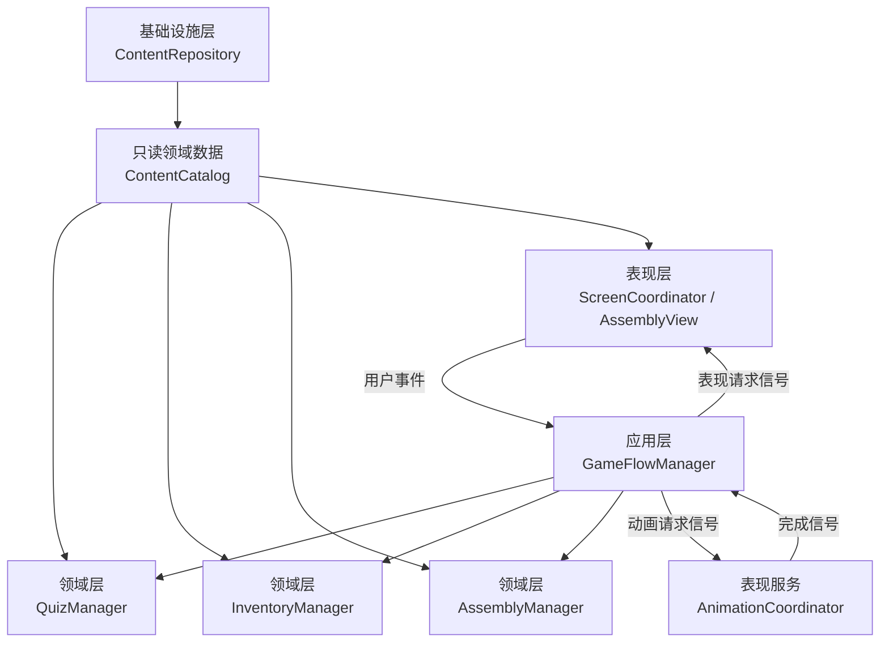
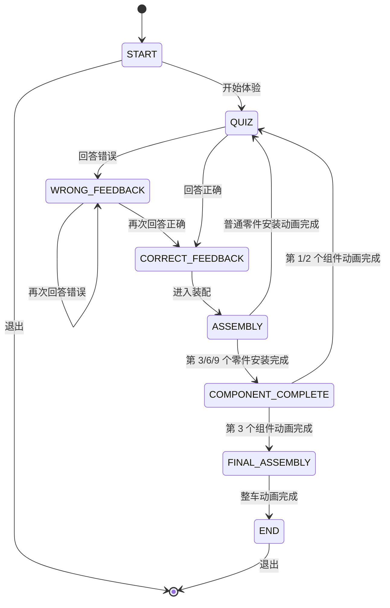
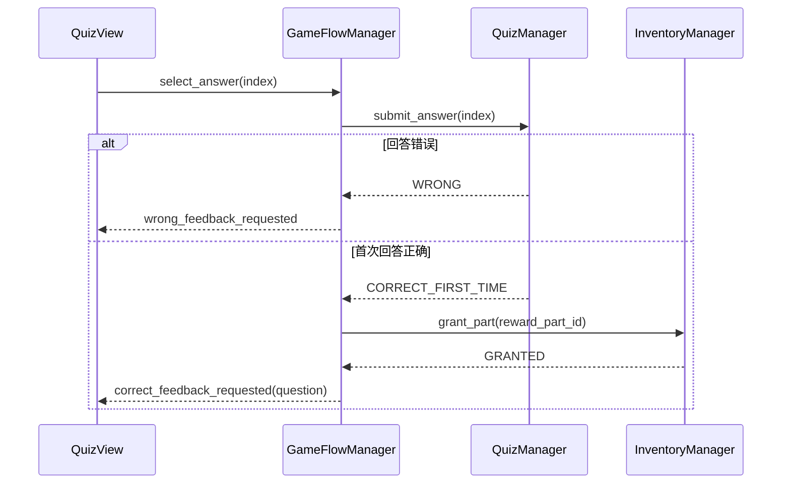
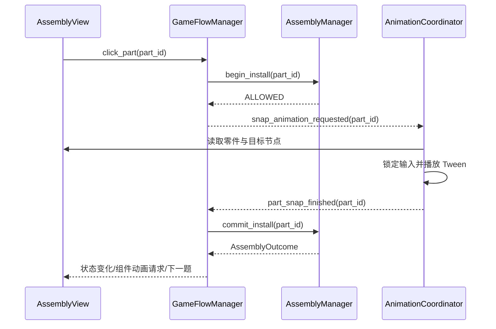

# RailCraft Demo 详细设计文档

> 文档状态：可实施设计  
> 需求基线：`doc/proposal.md`，最后确认日期 2026-07-18  
> 适用版本：RailCraft Demo 首版  
> 目标引擎：Godot Standard 4.6.3-stable，Compatibility 渲染器  
> 文档用途：指导工程搭建、编码、测试、构建和验收

## 1. 文档目标

本文档把需求基线细化为可直接实施的工程设计，重点定义：

- 运行时架构、模块边界和依赖方向；
- 状态机、事件流和异常处理；
- JSON 数据结构、内存数据类型和校验规则；
- Godot 场景组织、3D 零件契约和模型替换方式；
- 各模块的公开接口、输入输出和独立测试方法；
- 自动化测试、静态检查、持续集成和 Windows 构建方案；
- 需求到设计及测试的追踪关系。

本文档只覆盖首版 Demo。需求基线明确排除的联网、存档、计分、多人、拖拽物理、自由镜头、音频等能力不进入本设计。

## 2. 设计原则

### 2.1 单一职责

每个核心模块只维护一类业务状态：

- `ContentRepository`：内容读取、反序列化和数据校验；
- `QuizManager`：当前题目、作答结果和题目推进；
- `InventoryManager`：已获得零件及奖励幂等性；
- `AssemblyManager`：安装顺序、待安装状态、组件和整车完成判定；
- `GameFlowManager`：状态机和跨模块业务编排；
- `AnimationCoordinator`：动画播放、交互锁定和动画完成通知；
- `ScreenCoordinator`：界面显隐及数据展示；
- `AssemblyView`：3D 零件实例、安装目标和视觉提示。

### 2.2 依赖方向

依赖统一从表现层指向应用层和领域层。领域模块不访问 UI 节点、3D 节点、文件系统、网络或计时器。



### 2.3 组合根与依赖注入

`AppRoot` 是唯一组合根，负责创建模块、注入 `ContentCatalog`、连接信号和启动流程。核心管理器不注册为 Godot Autoload，避免形成难以隔离的全局状态。

测试可直接构造单个管理器并传入固定数据。流程测试使用即时完成的假动画适配器和记录型界面适配器，不加载真实 3D 场景。

### 2.4 数据驱动

题目、零件、组件配方、模型场景路径、安装目标及安装变换均来自 JSON。运行时代码不按题号或零件名称编写分支。

首版“固定 9 题、9 个零件、3 个组件”由内容基线测试保证。通用业务模块按数据集合运行，以便未来扩充内容时复用。

### 2.5 确定性与幂等性

- 同一题首次答对时只产生一次奖励；
- 同一零件只能进入一次待安装状态并只能提交一次安装；
- 动画期间所有会改变进度的输入均被锁定；
- 动画完成回调携带业务 ID，旧回调或重复回调会被忽略；
- 状态转换必须经过白名单校验，非法转换记录错误并保持原状态。

## 3. 总体架构

### 3.1 分层

| 层级 | 内容 | 可依赖对象 | 禁止依赖对象 |
|---|---|---|---|
| 领域数据层 | `QuestionData`、`PartData`、`ComponentRecipe`、`ContentCatalog`、结果值对象 | 基础 Godot 类型 | 场景节点、文件系统、动画 |
| 领域逻辑层 | `QuizManager`、`InventoryManager`、`AssemblyManager` | 领域数据层 | UI、3D、文件系统 |
| 应用编排层 | `GameFlowManager` | 三个领域管理器 | 具体按钮、具体 Tween、模型网格 |
| 基础设施层 | `ContentRepository`、JSON 解析、校验器 | 领域数据层、`FileAccess`、`ResourceLoader` | 业务流程推进 |
| 表现层 | 页面控制器、`AssemblyView`、`PartActor`、`ScreenCoordinator` | 应用层输出、领域只读数据 | 奖励和完成判定 |
| 表现服务层 | `AnimationCoordinator` | 表现层节点 | 作答、库存和装配规则 |

### 3.2 运行时组件

`Main.tscn` 启动后常驻一个场景树。页面切换采用显隐控制，不在题目与装配之间频繁销毁主场景，从而保留已安装的 3D 零件。

```text
AppRoot (Node)
├─ DomainServices (Node)
│  ├─ GameFlowManager
│  ├─ QuizManager
│  ├─ InventoryManager
│  └─ AssemblyManager
├─ PresentationServices (Node)
│  ├─ ScreenCoordinator
│  └─ AnimationCoordinator
├─ WorldRoot (Node3D)
│  ├─ Environment
│  ├─ FixedCamera
│  ├─ TrainAssemblyRoot
│  ├─ PartPreviewAnchor
│  └─ AssemblyView
└─ UILayer (CanvasLayer)
   ├─ StartView
   ├─ QuizView
   ├─ AssemblyHUD
   ├─ ComponentCompleteOverlay
   ├─ EndView
   └─ FatalErrorView
```

`FatalErrorView` 只处理内容或资源损坏等开发/交付错误。正常体验中不会出现。

### 3.3 启动顺序

1. Godot 加载 `Main.tscn`。
2. `AppRoot._ready()` 创建 `ContentRepository`。
3. 仓储依次读取 `questions.json`、`parts.json`、`recipes.json`。
4. 仓储将 JSON 转换为类型化领域对象并执行结构及引用校验。
5. `AssemblyAssetValidator` 检查模型场景和安装目标节点是否存在。
6. 校验成功后，`AppRoot` 向三个领域管理器注入同一个只读 `ContentCatalog`。
7. `AppRoot` 连接用户事件、流程输出事件和动画完成事件。
8. `GameFlowManager.initialize()` 进入 `START`，显示开始页面。
9. 任一步失败时进入不可交互的致命错误视图，显示错误编号和简短中文说明，同时把详细信息写到标准错误输出；程序仍保留“退出”按钮。

运行时不读取网络，不写入 `user://`，也不创建存档。

## 4. 工程目录设计

```text
railcraft-demo/
├─ .github/
│  └─ workflows/
│     ├─ quality.yml
│     └─ build-windows.yml
├─ addons/
│  └─ gut/
├─ assets/
│  ├─ fonts/
│  ├─ materials/
│  ├─ models/
│  │  ├─ placeholders/
│  │  ├─ production/
│  │  └─ source/
│  └─ ui/
├─ data/
│  ├─ questions.json
│  ├─ parts.json
│  └─ recipes.json
├─ doc/
│  ├─ proposal.md
│  ├─ detailed-design.md
│  ├─ running.md
│  ├─ development.md
│  └─ sources.md
├─ scenes/
│  ├─ main/main.tscn
│  ├─ quiz/quiz_view.tscn
│  ├─ assembly/
│  │  ├─ assembly_view.tscn
│  │  └─ part_actor.tscn
│  ├─ train/
│  │  ├─ train_root.tscn
│  │  └─ parts/*.tscn
│  └─ ui/
│     ├─ start_view.tscn
│     ├─ assembly_hud.tscn
│     ├─ component_complete_overlay.tscn
│     ├─ end_view.tscn
│     └─ fatal_error_view.tscn
├─ scripts/
│  ├─ app/app_root.gd
│  ├─ domain/
│  │  ├─ content_types.gd
│  │  ├─ quiz_manager.gd
│  │  ├─ inventory_manager.gd
│  │  └─ assembly_manager.gd
│  ├─ flow/game_flow_manager.gd
│  ├─ infrastructure/
│  │  ├─ content_repository.gd
│  │  ├─ content_validator.gd
│  │  └─ assembly_asset_validator.gd
│  └─ presentation/
│     ├─ screen_coordinator.gd
│     ├─ animation_coordinator.gd
│     ├─ assembly_view.gd
│     └─ part_actor.gd
├─ tests/
│  ├─ fixtures/
│  ├─ unit/
│  ├─ integration/
│  └─ smoke/
├─ builds/
├─ project.godot
├─ export_presets.cfg
├─ pyproject.toml
├─ uv.lock
├─ .python-version
├─ .pre-commit-config.yaml
├─ .gitignore
├─ .gitattributes
└─ README.md
```

目录约束：

- `scripts/domain/` 不引用 `scenes/`；
- `data/` 不保存本机绝对路径；
- `assets/models/placeholders/` 保存首版低多边形资源；
- `assets/models/production/` 预留优化后的 GLB；
- `assets/models/source/` 由 Git LFS 跟踪未来的源模型；
- `builds/` 只存本地临时构建，默认被 Git 忽略；
- 每个脚本原则上只声明一个公开类型。

## 5. 领域数据设计

### 5.1 标识符

所有 ID 使用小写 ASCII `snake_case`，运行时按字符串精确比较。

| 类型 | 首版 ID |
|---|---|
| 题目 | `q01` 至 `q09` |
| 零件 | `body_shell`、`passenger_door`、`coupler_buffer`、`bogie_frame`、`wheelset`、`brake_unit`、`pantograph`、`traction_converter_unit`、`traction_motor` |
| 组件 | `carbody_connection`、`running_braking`、`traction_power` |
| 整车 | `generic_high_speed_emu` |

显示名称只用于界面。任何业务判断都使用 ID。

### 5.2 questions.json

```json
{
  "schema_version": 1,
  "questions": [
    {
      "question_id": "q01",
      "order": 1,
      "prompt": "动车组车体的主要作用是什么？",
      "options": [
        "承载乘客和车载设备，并形成车内空间",
        "从接触网获取电能",
        "直接驱动车轮旋转",
        "控制铁路信号机"
      ],
      "correct_option_index": 0,
      "explanation": "车体是车辆的重要承载结构，为乘客、设备和车内设施提供安装与使用空间。不同动车组的车体材料、尺寸和结构会有差异。",
      "source": {
        "organization": "中国中车",
        "title": "和谐号CRH6型城际动车组",
        "url": "https://www.crrcgc.cc/pz/2013-12/28/article_0C37D1973CFB4C6382B32FD53F5A40B5.html"
      },
      "reward_part_id": "body_shell"
    }
  ]
}
```

规则：

- `correct_option_index` 使用从 0 开始的索引；
- `order` 从 1 连续递增；
- `options` 恰好包含 4 个非空字符串；
- `source` 三个字段全部显示为普通文本；
- UI 不把来源 URL 转换为运行时联网操作；
- 首版 9 道题的文案、选项、答案、解析和来源逐字采用需求基线。

### 5.3 parts.json

```json
{
  "schema_version": 1,
  "parts": [
    {
      "part_id": "body_shell",
      "display_name": "车体外壳",
      "order": 1,
      "component_id": "carbody_connection",
      "model_scene_path": "res://scenes/train/parts/body_shell.tscn",
      "snap_target_path": "SnapTargets/BodyShellTarget",
      "target_transform": {
        "position": [0.0, 0.0, 0.0],
        "rotation_degrees": [0.0, 0.0, 0.0],
        "scale": [1.0, 1.0, 1.0]
      },
      "preview_transform": {
        "position": [0.0, 0.0, 0.0],
        "rotation_degrees": [0.0, 20.0, 0.0],
        "scale": [1.0, 1.0, 1.0]
      },
      "required_previous_part_id": null
    }
  ]
}
```

字段约束：

- `model_scene_path` 必须以 `res://` 开头且指向可实例化的 `PackedScene`；
- 模型场景根节点必须继承 `Node3D`；
- `snap_target_path` 相对于 `TrainAssemblyRoot`；
- `target_transform` 是相对安装目标的微调；
- `preview_transform` 是相对预览锚点的展示变换；
- 第一项的 `required_previous_part_id` 为 `null`；
- 其余项指向前一个安装序号的零件，形成单链依赖；
- `order` 同时定义展示顺序和首版固定安装顺序。

### 5.4 recipes.json

```json
{
  "schema_version": 1,
  "components": [
    {
      "component_id": "carbody_connection",
      "display_name": "车体与连接组件",
      "order": 1,
      "part_ids": [
        "body_shell",
        "passenger_door",
        "coupler_buffer"
      ],
      "completion_message": "车体与连接组件已完成",
      "teaching_note": "车体、车门和车钩缓冲装置共同形成车辆承载、乘用和连接功能的教学抽象。"
    }
  ],
  "train_recipe": {
    "train_id": "generic_high_speed_emu",
    "display_name": "通用高速电力动车组",
    "component_ids": [
      "carbody_connection",
      "running_braking",
      "traction_power"
    ]
  }
}
```

首版每个组件恰好包含三个零件。组件完成顺序由 `order` 和零件安装顺序共同确定。

`traction_power` 的 `teaching_note` 必须使用以下含义完整的中文说明：

> 本 Demo 将受电弓、主变压器/牵引变流器和牵引电机归入一个教学组件。真实车辆中这些设备通常分布在不同位置，具体布置因车型而异。

该说明在第三个组件完成覆盖层中显示，确保教学抽象的边界在游戏内可见。其他组件也提供一条简短 `teaching_note`，用于解释其教学归类。

### 5.5 内存类型

JSON 解析完成后转换为以下只读用途的类型化对象：

| 类型 | 核心字段 |
|---|---|
| `SourceData` | `organization: String`、`title: String`、`url: String` |
| `QuestionData` | `question_id`、`order`、`prompt`、`options: Array[String]`、`correct_option_index`、`explanation`、`source`、`reward_part_id` |
| `TransformData` | `position: Vector3`、`rotation_degrees: Vector3`、`scale: Vector3` |
| `PartData` | `part_id`、`order`、`component_id`、场景与安装字段 |
| `ComponentRecipe` | `component_id`、`order`、`part_ids: Array[String]`、`completion_message`、`teaching_note` |
| `TrainRecipe` | `train_id`、`display_name`、`component_ids: Array[String]` |
| `ContentCatalog` | 排序数组及按 ID 索引的字典 |
| `ValidationIssue` | `code`、`json_path`、`message`、`severity` |

`ContentCatalog` 创建完成后不向业务模块暴露可修改的内部字典。查询方法返回对象引用或数组副本。

### 5.6 内容校验

校验分三层执行：

#### 结构校验

- 三个文件均可读取且 JSON 语法有效；
- 根对象及必要数组存在；
- `schema_version == 1`；
- 必填字段类型正确且字符串非空；
- 题目选项数量、答案索引和 Transform 数组长度有效；
- ID 仅包含 `[a-z0-9_]`。

#### 关系校验

- 题目 ID、零件 ID、组件 ID 各自唯一；
- 问题奖励引用存在的零件；
- 每个零件恰好被一道题奖励；
- 每个零件恰好属于一个组件配方；
- 配方引用的零件及组件全部存在；
- 依赖引用存在，且依赖图无环；
- 题目、零件和组件的 `order` 连续且无重复；
- 问题顺序与其奖励零件的顺序一致；
- 整车配方覆盖全部组件。

#### 首版基线校验

- 恰好 9 道题、9 个零件和 3 个组件；
- 每个组件恰好 3 个零件；
- 9 个需求指定零件及 3 个需求指定组件全部存在；
- 固定题目内容与 `tests/fixtures/expected_question_baseline.json` 一致；
- 安装顺序与需求第 6.2 节一致。

结构和关系校验属于通用运行时校验。首版数量及文案约束主要由自动化测试执行，保持核心模块未来可扩展。

## 6. 状态机设计

### 6.1 状态定义

```gdscript
enum GameState {
    START,
    QUIZ,
    WRONG_FEEDBACK,
    CORRECT_FEEDBACK,
    ASSEMBLY,
    COMPONENT_COMPLETE,
    FINAL_ASSEMBLY,
    END,
}
```

状态语义：

| 状态 | 允许的用户输入 | 主要界面 |
|---|---|---|
| `START` | 开始体验、退出 | 开始页 |
| `QUIZ` | 选择一个答案 | 答题页 |
| `WRONG_FEEDBACK` | 再次选择答案 | 答题页及错误提示 |
| `CORRECT_FEEDBACK` | 进入装配 | 答题页、解析和来源 |
| `ASSEMBLY` | 动画开始前可单击当前零件 | 3D 装配页 |
| `COMPONENT_COMPLETE` | 无 | 组件完成覆盖层 |
| `FINAL_ASSEMBLY` | 无 | 3D 最终动画 |
| `END` | 退出 | 完成页 |

### 6.2 状态流



### 6.3 转换表

| 当前状态 | 事件 | 守卫条件 | 领域副作用 | 下一状态 |
|---|---|---|---|---|
| `START` | `start_requested` | 内容已就绪 | `QuizManager.start()`，发布第 1 题 | `QUIZ` |
| `QUIZ`/`WRONG_FEEDBACK` | `answer_selected(index)` | 索引有效且当前题未解决 | 执行作答 | 按结果进入错误或正确反馈 |
| `QUIZ`/`WRONG_FEEDBACK` | 正确结果 | 当前题首次答对 | `InventoryManager.grant_part()` | `CORRECT_FEEDBACK` |
| `CORRECT_FEEDBACK` | `assembly_requested` | 奖励零件已拥有，且等于待安装零件 | 发布装配准备请求 | `ASSEMBLY` |
| `ASSEMBLY` | `part_clicked(part_id)` | 无待处理动画、零件已拥有、顺序正确 | `AssemblyManager.begin_install()` | 保持 `ASSEMBLY` 并锁定输入 |
| `ASSEMBLY` | `snap_finished(part_id)` | 回调 ID 等于待安装 ID | `commit_install()`；普通零件随后执行 `advance_after_assembly()` | `QUIZ` 或 `COMPONENT_COMPLETE` |
| `COMPONENT_COMPLETE` | `component_animation_finished(id)` | 回调 ID 等于待完成组件 | 若整车未完成则推进题号 | `QUIZ` 或 `FINAL_ASSEMBLY` |
| `FINAL_ASSEMBLY` | `final_animation_finished` | 整车已完成 | 发布完成页数据 | `END` |
| `START`/`END` | `exit_requested` | 无 | `get_tree().quit()` | 终止 |

### 6.4 错误答案处理

错误答案只产生以下效果：

1. `QuizManager` 返回 `WRONG`；
2. 流程进入或保持 `WRONG_FEEDBACK`；
3. 显示固定文本“回答错误，请再试一次”；
4. 四个选项保持可点击；
5. 不调用库存模块，不展示解析，不推进题号。

### 6.5 正确答案处理

1. `QuizManager` 把当前题标记为已解决；
2. `InventoryManager.grant_part()` 首次发放奖励零件；
3. 四个答案按钮全部禁用；
4. 显示正确提示、完整解析、来源机构、资料标题和 URL；
5. 显示“进入装配”按钮；
6. 所有重复作答事件均被领域层的已解决检查拒绝。

### 6.6 第 9 个零件后的顺序

第 9 个零件吸附完成后，流程固定为：

```text
提交牵引电机安装
→ 播放“牵引供电组件已完成”动画
→ 播放整车完成动画
→ 显示完成祝贺文字和退出按钮
```

第三个组件完成反馈不会被最终动画跳过。

## 7. 核心模块详细设计

### 7.1 ContentRepository

**职责**

- 从固定 `res://data/` 路径读取三个 JSON 文件；
- 解析 JSON 并转换为类型化领域对象；
- 调用内容校验器；
- 成功时返回完整 `ContentCatalog`；
- 失败时一次性返回全部可定位问题。

**公开接口**

```gdscript
func load_catalog() -> ContentLoadResult
```

`ContentLoadResult`：

```text
is_success: bool
catalog: ContentCatalog       # 失败时为空
issues: Array[ValidationIssue]
```

**依赖**

- `FileAccess`；
- `JSON`；
- `ContentValidator`；
- 领域数据类型。

**不负责**

- 当前题目、奖励、安装和界面状态；
- 自动修补错误数据；
- 访问网页验证来源。

**独立测试**

- 使用 `tests/fixtures/` 中的有效及无效 JSON；
- 覆盖缺文件、语法错误、缺字段、重复 ID、无效引用、依赖环；
- 不加载主场景。

### 7.2 ContentValidator

**职责**

- 执行第 5.6 节的结构与关系校验；
- 每个问题给出稳定错误码和 JSON 路径；
- 尽可能收集多个问题后统一返回。

**公开接口**

```gdscript
func validate(raw_questions: Dictionary, raw_parts: Dictionary, raw_recipes: Dictionary) -> Array[ValidationIssue]
```

主要错误码：

| 错误码 | 含义 |
|---|---|
| `CONTENT_FILE_MISSING` | 文件不存在 |
| `JSON_PARSE_FAILED` | JSON 语法无效 |
| `FIELD_MISSING` | 必填字段缺失 |
| `FIELD_TYPE_INVALID` | 字段类型错误 |
| `ID_DUPLICATE` | 同类 ID 重复 |
| `REFERENCE_NOT_FOUND` | 引用目标不存在 |
| `ORDER_INVALID` | 顺序重复、不连续或不一致 |
| `DEPENDENCY_CYCLE` | 安装依赖成环 |
| `CONTENT_COVERAGE_INVALID` | 题目、零件、组件未完整覆盖 |

**独立测试**

每条规则至少一个正例和一个反例。测试只传入字典，不访问文件和场景。

### 7.3 AssemblyAssetValidator

**职责**

- 检查每个 `model_scene_path` 可加载为 `PackedScene`；
- 检查实例根节点继承 `Node3D`；
- 检查 `TrainAssemblyRoot` 中的 `snap_target_path` 存在且指向 `Marker3D`；
- 检查模型包含可供点击的 `PartActor` 契约节点；
- 完成后立即释放临时实例。

该模块与内容结构校验分离，使 `ContentRepository` 可在无 3D 场景的单元测试中运行。

**独立测试**

使用最小测试场景验证有效资源、缺失场景、错误根类型和缺失目标节点。

### 7.4 QuizManager

**内部状态**

```text
questions: Array[QuestionData]
current_index: int
current_question_solved: bool
started: bool
```

**公开接口**

```gdscript
func configure(questions: Array[QuestionData]) -> void
func start() -> QuestionData
func get_current_question() -> QuestionData
func submit_answer(option_index: int) -> AnswerResult
func advance_after_assembly() -> bool
func has_next_question() -> bool
func reset() -> void
```

`AnswerResult.status` 枚举：

- `WRONG`；
- `CORRECT_FIRST_TIME`；
- `ALREADY_SOLVED`；
- `INVALID_OPTION`；
- `NOT_STARTED`。

**约束**

- 只有 `advance_after_assembly()` 可以改变题号；
- 正确作答后到装配完成前，题号保持不变；
- `submit_answer()` 不发放奖励；
- `submit_answer()` 不访问任何 UI。

**独立测试**

- 初始题、错误重试、正确锁定、重复正确、非法索引、题目推进和末题边界；
- 使用内存中的两道最小题目即可完成全部单元测试。

### 7.5 InventoryManager

**内部状态**

```text
known_part_ids: Dictionary[String, bool]
owned_part_ids: Dictionary[String, bool]
```

**公开接口**

```gdscript
func configure(parts: Array[PartData]) -> void
func grant_part(part_id: String) -> GrantResult
func has_part(part_id: String) -> bool
func get_owned_part_ids() -> Array[String]
func reset() -> void
```

`GrantResult`：`GRANTED`、`ALREADY_OWNED`、`UNKNOWN_PART`。

**约束**

- 使用集合保证同一零件最多发放一次；
- 返回的零件 ID 数组为副本；
- 不保存安装状态；
- 不访问磁盘。

**独立测试**

覆盖首次发放、重复发放、未知 ID、查询和重置。

### 7.6 AssemblyManager

**内部状态**

```text
ordered_parts: Array[PartData]
components: Array[ComponentRecipe]
installed_part_ids: Dictionary[String, bool]
completed_component_ids: Dictionary[String, bool]
pending_part_id: String
next_part_index: int
train_completed: bool
```

**公开接口**

```gdscript
func configure(parts: Array[PartData], components: Array[ComponentRecipe], train_recipe: TrainRecipe) -> void
func get_expected_part_id() -> String
func can_begin_install(part_id: String) -> InstallCheck
func begin_install(part_id: String) -> InstallCheck
func commit_install(part_id: String) -> AssemblyOutcome
func abort_pending_install(part_id: String) -> void
func is_part_installed(part_id: String) -> bool
func is_train_completed() -> bool
func reset() -> void
```

`InstallCheck.status`：

- `ALLOWED`；
- `OUT_OF_ORDER`；
- `ALREADY_INSTALLED`；
- `ANOTHER_INSTALL_PENDING`；
- `UNKNOWN_PART`；
- `PREREQUISITE_MISSING`。

`AssemblyOutcome`：

```text
status
installed_part_id
completed_component_id   # 本次没有完成组件时为空
train_completed
next_expected_part_id    # 全部完成时为空
```

**事务边界**

- `begin_install()` 只登记待安装项，不改变已安装集合；
- 3D 吸附动画成功后才调用 `commit_install()`；
- 动画无法启动时调用 `abort_pending_install()`，允许玩家重试；
- `commit_install()` 必须收到与待安装项相同的 ID；
- 组件完成及整车完成只在提交安装时计算一次。

**独立测试**

- 正确顺序、越序、重复、依赖缺失、并发待安装、提交 ID 不匹配；
- 每三个零件完成组件；
- 三个组件完成整车；
- 无动画、无 UI、无场景依赖。

### 7.7 GameFlowManager

**职责**

- 持有唯一 `GameState`；
- 接收用户意图和动画完成通知；
- 按第 6 节调用领域模块；
- 通过信号发布界面及动画请求；
- 校验状态与事件是否匹配；
- 保证奖励、安装和题号推进的顺序。

**输入接口**

```gdscript
func initialize(catalog: ContentCatalog) -> void
func request_start() -> void
func select_answer(option_index: int) -> void
func request_assembly() -> void
func click_part(part_id: String) -> void
func notify_snap_finished(part_id: String) -> void
func notify_snap_failed(part_id: String, reason: String) -> void
func notify_component_animation_finished(component_id: String) -> void
func notify_final_animation_finished() -> void
func request_exit() -> void
```

**输出信号**

```gdscript
signal state_changed(previous: GameState, current: GameState)
signal question_presented(question: QuestionData, current_number: int, total: int)
signal wrong_feedback_requested(message: String)
signal correct_feedback_requested(question: QuestionData)
signal assembly_preparation_requested(part: PartData)
signal snap_animation_requested(part_id: String)
signal component_animation_requested(component: ComponentRecipe)
signal final_animation_requested(train_recipe: TrainRecipe)
signal end_view_requested(train_name: String)
signal recoverable_error_occurred(code: String, message: String)
```

**依赖**

- `QuizManager`；
- `InventoryManager`；
- `AssemblyManager`；
- 只读 `ContentCatalog`。

**不负责**

- JSON 加载；
- 控件显隐；
- Tween 创建；
- 模型实例化；
- 窗口尺寸和主题。

**独立测试**

- 直接调用输入接口并记录输出信号；
- 动画请求后由测试立即调用对应完成通知；
- 覆盖完整 9 题正确路径、每题先错后对路径、重复点击、旧动画回调和所有非法状态事件；
- 断言流程最终可到达 `END`。

### 7.8 AnimationCoordinator

**职责**

- 播放零件吸附、组件完成和整车完成动画；
- 在异步动画期间锁定相关输入；
- 通过带 ID 的信号报告成功或失败；
- 清理 Tween、临时高亮和临时材质。

**公开接口**

```gdscript
func play_part_snap(part_id: String) -> void
func play_component_complete(component_id: String) -> void
func play_final_assembly() -> void
func is_busy() -> bool
func cancel_all_for_shutdown() -> void
```

**输出信号**

```gdscript
signal part_snap_finished(part_id: String)
signal part_snap_failed(part_id: String, reason: String)
signal component_animation_finished(component_id: String)
signal final_animation_finished
```

**约束**

- 同一时刻只运行一个进度动画；
- 所有回调均在清除忙碌状态后发出；
- 动画只修改显示节点，不修改领域集合；
- 使用 Godot `Tween`，不引入第三方动画运行库；
- 无随机持续时间，便于复现和测试。

**独立测试**

- 在最小 Node3D 测试场景中播放缩短版动画；
- 断言忙碌锁、最终变换、完成信号和重复调用拒绝；
- 流程测试使用假协调器，避免依赖真实帧时间。

### 7.9 ScreenCoordinator

**职责**

- 根据 `GameState` 显示唯一主页面或覆盖层；
- 向视图填充题目、进度、反馈、来源和组件名称；
- 控制按钮启用状态；
- 把视图用户信号转发给 `GameFlowManager`；
- 维持 960×540 至更大窗口的锚点布局。

**页面映射**

| 状态 | 可见视图 |
|---|---|
| `START` | `StartView` |
| `QUIZ`、`WRONG_FEEDBACK`、`CORRECT_FEEDBACK` | `QuizView` |
| `ASSEMBLY` | `WorldRoot`、`AssemblyHUD` |
| `COMPONENT_COMPLETE` | `WorldRoot`、`AssemblyHUD`、`ComponentCompleteOverlay` |
| `FINAL_ASSEMBLY` | `WorldRoot` |
| `END` | `WorldRoot`、`EndView` |

**独立测试**

加载单个 UI 场景，传入固定数据，断言文本、按钮状态、显隐和信号。测试不执行作答判定。

### 7.10 AssemblyView

**职责**

- 根据 `PartData` 实例化当前奖励零件；
- 在 `PartPreviewAnchor` 展示待安装零件；
- 在目标位置创建半透明发光提示；
- 暴露零件节点、目标节点和组件节点给动画协调器；
- 安装完成后禁用点击碰撞并把实例归入对应组件容器；
- 维护表现层的 `part_id -> PartActor` 映射。

**公开接口**

```gdscript
func prepare_part(part: PartData) -> bool
func get_part_actor(part_id: String) -> PartActor
func get_snap_target(part_id: String) -> Marker3D
func finalize_visual_install(part_id: String) -> void
func show_component_highlight(component_id: String) -> void
func clear_component_highlight(component_id: String) -> void
func set_part_interaction_enabled(enabled: bool) -> void
```

**输出信号**

```gdscript
signal part_clicked(part_id: String)
```

**独立测试**

- 用简单立方体零件场景验证实例化、目标查找、点击信号、视觉归组和清理；
- 不依赖题库和库存模块。

## 8. 模块通信设计

### 8.1 用户答题时序



### 8.2 零件安装时序



### 8.3 信号连接规则

- 信号只在 `AppRoot` 中集中连接；
- 视图不直接连接领域管理器；
- 领域管理器之间不互发信号；
- 所有异步完成信号必须携带对应 ID；
- `AppRoot` 退出树时断开外部信号并取消动画；
- 连接使用显式 `Callable`，避免字符串方法名。

## 9. Godot 场景与 3D 设计

### 9.1 坐标和单位

- 1 Godot 单位按约 1 米理解；
- 列车纵向采用 `+X`；
- 竖直方向采用 `+Y`；
- 横向采用 `+Z`；
- 安装目标全部位于 `TrainAssemblyRoot` 局部坐标系；
- 模型场景根节点原点设置在其安装基准点。

### 9.2 固定摄像机

- 使用单个 `Camera3D`；
- 采用斜前上方的三分之四视角，完整容纳车体和安装平台；
- 玩家不能旋转、平移或缩放；
- 组件完成和最终动画保持固定机位，可调整列车节点或灯光；
- 1280×720 下完整显示，960×540 下不裁切关键零件。

### 9.3 TrainAssemblyRoot 契约

```text
TrainAssemblyRoot (Node3D)
├─ Components (Node3D)
│  ├─ CarbodyConnection (Node3D)
│  ├─ RunningBraking (Node3D)
│  └─ TractionPower (Node3D)
├─ SnapTargets (Node3D)
│  ├─ BodyShellTarget (Marker3D)
│  ├─ PassengerDoorTarget (Marker3D)
│  ├─ CouplerBufferTarget (Marker3D)
│  ├─ BogieFrameTarget (Marker3D)
│  ├─ WheelsetTarget (Marker3D)
│  ├─ BrakeUnitTarget (Marker3D)
│  ├─ PantographTarget (Marker3D)
│  ├─ TractionConverterTarget (Marker3D)
│  └─ TractionMotorTarget (Marker3D)
├─ Headlights (Node3D)
└─ FinalAnimationAnchors (Node3D)
```

Snap Target 只定义安装基准，不包含业务脚本。

### 9.4 零件场景契约

每个 `model_scene_path` 指向一个符合以下契约的场景：

```text
PartActor (Node3D, script=part_actor.gd)
├─ VisualRoot (Node3D)
│  └─ MeshInstance3D ...
├─ ClickArea (Area3D)
│  └─ CollisionShape3D
└─ AnimationNodes (Node3D, 可选)
```

规则：

- `PartActor.part_id` 在实例化后由 `AssemblyView` 注入；
- `ClickArea` 只在待安装阶段启用；
- 安装后碰撞层和输入均禁用；
- `VisualRoot` 下允许替换为 GLB 实例；
- 交互脚本不挂在 GLB 内部网格上；
- 模型替换只需建立新的兼容场景并更新 JSON 路径与变换。

### 9.5 发光安装提示

`AssemblyView` 在目标位置实例化当前零件的视觉副本：

- 禁用其碰撞和脚本处理；
- 对所有 `GeometryInstance3D` 应用半透明青蓝色发光覆盖材质；
- 以 0.75 至 1.0 秒周期轻微脉动透明度；
- 显示期间不改变已安装零件材质；
- 吸附动画开始时保留提示，动画结束后移除；
- Compatibility 渲染器下不依赖屏幕后处理描边。

### 9.6 低多边形列车表现

首版使用基础几何体和少量程序化网格：

- 车体：长条主体、流线型车头、连续深色窗带；
- 车门：与车体有明度差的矩形嵌板；
- 车钩缓冲装置：端部圆柱与箱体组合；
- 转向架构架：深灰框架；
- 轮对：车轴加左右圆柱轮；
- 制动装置：靠近车轮的盘形或夹钳抽象件；
- 受电弓：可折叠的单臂或菱形结构；
- 牵引变压变流单元：车下箱体；
- 牵引电机：转向架附近圆柱或箱体。

列车不使用真实车型编号、真实 Logo 或特定车型完整涂装。

### 9.7 材质和灯光

- 车体主色采用浅灰白；
- 使用抽象蓝色主装饰和少量红色点缀；
- 走行部使用深灰；
- 受电弓和电气设备使用高辨识度深灰/橙色细节；
- 主光采用 `DirectionalLight3D`，补光采用少量低强度 `OmniLight3D`；
- 环境使用明亮装配展台，材质保持低复杂度；
- 默认不使用大尺寸纹理。

## 10. 动画详细设计

### 10.1 零件吸附动画

总时长目标为 0.9 秒：

1. 0.15 秒轻微放大并抬升，确认点击；
2. 0.60 秒沿平滑曲线移动到目标，同时插值旋转和缩放；
3. 0.15 秒轻微回弹并精确落到目标 Transform；
4. 移除目标发光提示，禁用零件点击；
5. 发出 `part_snap_finished(part_id)`。

缓动建议：主移动 `TRANS_CUBIC + EASE_IN_OUT`，回弹使用较弱的 `TRANS_BACK + EASE_OUT`。

动画过程中：

- `AnimationCoordinator.is_busy() == true`；
- `AssemblyView` 禁止零件输入；
- UI 不显示额外可推进按钮；
- 重复点击和重复动画请求均被忽略并记录调试日志。

### 10.2 组件完成动画

每安装第 3、6、9 个零件后播放约 1.4 秒：

1. 对该组件的三个已安装零件增加短暂发光；
2. 组件整体轻微上浮后回到原位，位移幅度不超过 0.08 米；
3. 覆盖层显示“{组件名称}已完成”和该组件的 `teaching_note`；
4. 普通组件覆盖层至少停留 2.8 秒；第三个组件的教学边界说明至少停留 4 秒；
5. 清除临时材质并发出带 `component_id` 的完成信号。

该动画不会重新实例化组件，也不会改变安装状态。

### 10.3 整车完成动画

总时长目标约 4.5 秒，固定顺序：

1. 三个系统级组件依次高亮，表示系统汇合；
2. 环境光稍微降低，完整列车整体清晰显现；
3. 前灯由灭到亮；
4. 受电弓从折叠状态升起；
5. 轮对轻微旋转；
6. 显示完成祝贺文字及“退出”按钮。

该方案包含前灯、受电弓和车轮三项完成反馈，满足至少两项的需求。

### 10.4 动画失败恢复

零件节点或目标节点缺失时：

- 不提交领域安装；
- 调用 `abort_pending_install(part_id)`；
- 恢复待安装零件点击；
- 显示“装配动画未能开始，请重试”；
- 输出包含 ID 和节点路径的错误日志。

组件或最终动画发生非关键视觉错误时，协调器清理临时状态并发出完成信号，保证主流程可继续。此降级只适用于灯光、高亮等附加效果；零件吸附失败必须重试。

## 11. 界面详细设计

### 11.1 全局布局

- 基准分辨率：1280×720；
- 最低分辨率：960×540；
- 拉伸模式采用适合 2D UI 的 `canvas_items`；
- 主容器使用 anchors 和 size flags；
- 页面四周保留至少 24 px 安全边距；
- 正文目标字号 22 px，按钮 22–24 px，标题 40–48 px；
- 长来源 URL 允许自动换行，不截断文本；
- 所有交互按钮保持明确的普通、悬停、按下和禁用状态。

### 11.2 中文字体

项目内随包提供具备简体中文完整字形且许可清晰的字体，首选 Noto Sans SC Regular/Bold。字体文件和许可证来源记录在 `doc/sources.md`。

整个 UI 通过一个项目 Theme 引用字体，禁止依赖目标电脑恰好安装某款中文字体。

### 11.3 开始页

布局：

- 上方：`RailCraft Demo` 标题；
- 中部：两至三行中文玩法说明；
- 下方：“开始体验”主按钮和“退出”次按钮。

建议说明文案：

> 回答 9 道铁路知识题，每次答对后点击新零件完成装配。按固定顺序完成三个系统组件，最终组装一列通用高速电力动车组。

### 11.4 答题页

布局：

- 顶部左侧：“问题 N / 9”；
- 中部上方：题目文本；
- 中部：四个纵向排列的选项按钮，标注 A–D；
- 下方：反馈卡片；
- 正确后反馈卡片内显示解析、来源机构、资料标题、URL 和“进入装配”按钮。

行为：

- 初始及错误状态下四个选项可点击；
- 错误状态只显示固定错误文案；
- 正确状态禁用所有选项并显示完整来源；
- “进入装配”在正确状态前保持隐藏；
- 页面不提供跳题、返回或重新开始。

### 11.5 装配页

- 3D 区域占主要画面；
- 左上显示“装配 N / 9”和零件名称；
- 底部显示“点击新获得的零件，将它安装到发光位置”；
- 待安装零件放置在画面一侧的装配台上；
- 目标位置显示第 9.5 节的发光提示；
- 动画中提示改为“正在安装……”，且不接受点击；
- 组件完成覆盖层居中显示，不提供跳过按钮。

### 11.6 完成页

最终动画结束后，在保留完整列车的背景上显示半透明卡片：

- 标题：“列车装配完成！”；
- 正文：“你已完成 9 道铁路知识题，并组装了通用高速电力动车组的三个系统组件。”；
- “退出”按钮。

完成页不提供重新开始和返回主页。

### 11.7 可用性

- 按钮最小可点击高度 48 px；
- 文字与背景保持清晰对比；
- 颜色提示同时配合文字，避免仅用颜色表达状态；
- 所有中文在 Windows 构建中使用内嵌字体人工检查；
- 鼠标悬停能明确显示当前可交互对象。

## 12. 异常、日志与恢复设计

### 12.1 错误分类

| 分类 | 示例 | 处理 |
|---|---|---|
| 启动致命错误 | JSON 缺失、引用无效、场景缺失 | 显示致命错误页，禁止开始体验，可退出 |
| 可恢复流程错误 | 吸附动画节点临时无效 | 回滚待安装状态，恢复点击并提示重试 |
| 非关键表现错误 | 高亮材质设置失败 | 记录错误，清理后继续流程 |
| 非法用户/重复事件 | 动画中重复点击、旧回调 | 忽略，不改变状态，记录调试信息 |
| 编程错误 | 非法状态转换、提交错误 ID | `push_error`，测试环境失败，发布环境保持安全状态 |

### 12.2 日志内容

日志不得包含本机绝对路径、令牌或用户信息。关键日志包含：

- 当前和目标状态；
- `question_id`、`part_id` 或 `component_id`；
- 稳定错误码；
- 资源的 `res://` 相对路径；
- 简短处理结果。

正常运行不产生持久日志文件。

### 12.3 断言与发布行为

- 单元测试和开发模式对非法状态使用断言或明确失败结果；
- 发布构建避免因可恢复表现错误直接崩溃；
- 内容完整性错误在进入开始页前阻断；
- 禁止静默自动跳过题目或零件。

## 13. 自动化测试设计

### 13.1 测试分层

| 层级 | 目录 | 特点 |
|---|---|---|
| 单元测试 | `tests/unit/` | 单模块、内存数据、无真实动画 |
| 集成测试 | `tests/integration/` | 模块组合、数据与场景契约、信号时序 |
| 冒烟测试 | `tests/smoke/` | 加载主场景、执行最短完整流程、检查脚本错误 |

### 13.2 必测用例映射

| 编号 | 需求测试项 | 主要测试文件 | 测试层级 |
|---:|---|---|---|
| T01 | 题库成功加载 | `test_content_repository.gd` | 单元 |
| T02 | 题目、选项、答案、来源完整 | `test_content_validator.gd` | 单元 |
| T03 | 错误答案不发放零件 | `test_game_flow.gd` | 集成 |
| T04 | 正确答案只发放一次对应零件 | `test_inventory_manager.gd`、`test_game_flow.gd` | 单元/集成 |
| T05 | 答错后可再次作答 | `test_quiz_manager.gd`、`test_game_flow.gd` | 单元/集成 |
| T06 | 零件不能越序安装 | `test_assembly_manager.gd` | 单元 |
| T07 | 点击正确零件后完成吸附状态 | `test_assembly_animation.gd` | 集成 |
| T08 | 三个零件完成一个组件 | `test_assembly_manager.gd` | 单元 |
| T09 | 三个组件完成整车 | `test_assembly_manager.gd` | 单元 |
| T10 | 状态机无无法继续状态 | `test_game_flow_reachability.gd` | 集成 |
| T11 | 题库、零件、配方引用一致 | `test_content_validator.gd` | 单元 |
| T12 | 主场景可在 headless 加载 | `test_main_scene_smoke.gd` | 冒烟 |

### 13.3 补充回归用例

- 题目 ID、零件 ID、组件 ID 重复；
- 正确索引为负数或超过 3；
- 问题奖励引用不存在零件；
- 安装依赖成环；
- 动画期间连续点击当前零件；
- 前一个动画的延迟完成信号到达新状态；
- 第 3、6、9 个零件均触发且只触发一次组件动画；
- 第 9 个零件依次触发第三组件和最终动画；
- 来源 URL 在窄窗口自动换行；
- 960×540 与 1280×720 下关键控件不越界；
- 所有需求指定中文字符串能由内嵌字体覆盖；
- 模型场景替换后无需修改流程代码；
- 运行过程中没有 `user://` 写入调用；
- 完整流程结束时拥有 9 个零件、安装 9 个零件、完成 3 个组件。

### 13.4 状态机可达性测试

测试构建允许状态与事件图，对每个非终止状态验证至少存在一条通向 `END` 的路径，并执行两条端到端路径：

1. 9 题全部一次答对；
2. 每题先选一个错误答案，再选择正确答案。

两条路径都使用即时动画完成适配器，测试不等待真实时间。

### 13.5 测试隔离规则

- 每个测试创建全新管理器实例；
- `before_each` 构造数据，`after_each` 释放节点和信号连接；
- 禁止测试依赖执行顺序；
- 领域测试不加载 `Main.tscn`；
- 视图测试不修改领域状态；
- 动画测试使用固定持续时间覆盖值；
- 固定随机种子，首版本身不使用随机业务逻辑。

## 14. 静态检查与代码规范

### 14.1 GDScript 类型要求

- 函数参数和返回值全部声明类型；
- 成员变量和局部变量在类型无法明确推断时显式标注；
- 公开信号参数声明类型；
- 业务结果使用枚举和类型化值对象；
- 避免用无结构 `Dictionary` 在核心模块间传递业务结果；
- 对外公开类、状态机和非直观校验算法写简短文档注释。

### 14.2 警告策略

在 `project.godot` 中把以下类别配置为错误或严格警告：

- `UNTYPED_DECLARATION`；
- 适用的 `UNSAFE_METHOD_ACCESS`；
- 适用的 `UNSAFE_PROPERTY_ACCESS`；
- 适用的 `UNSAFE_CALL_ARGUMENT`；
- `UNUSED_PARAMETER` 只允许在信号接口等明确场景局部忽略。

具体警告名以 Godot 4.6.3 实际可用配置为准，并在 `doc/development.md` 记录。

### 14.3 Python 开发工具

```toml
[project]
requires-python = "==3.12.13"

[dependency-groups]
dev = [
  "gdtoolkit==4.5.0",
  "pre-commit==4.6.0"
]
```

标准命令：

```text
uv sync --frozen
uv run gdformat --check .
uv run gdlint .
uv run pre-commit run --all-files
```

`.python-version` 固定为 `3.12.13`，`uv.lock` 必须提交。

## 15. GitHub Actions 与构建设计

### 15.1 quality.yml

触发条件：

- 推送到所有开发分支；
- 针对 `main` 的 Pull Request；
- 手动触发。

作业顺序：

1. 检出仓库和 LFS 指针；
2. 安装固定 `uv 0.11.8`；
3. 由 uv 安装 Python 3.12.13；
4. 执行 `uv sync --frozen`；
5. 执行 `gdformat --check`；
6. 执行 `gdlint`；
7. 安装 Godot Standard 4.6.3；
8. 以 headless editor 模式导入项目；
9. 以 headless 模式加载主场景；
10. 运行全部 GUT 测试；
11. 无论成功或失败均上传测试结果。

所有第三方 Action 使用明确版本；完成兼容验证后优先固定完整提交 SHA，并在行尾注释对应上游版本标签，方便审计。

### 15.2 build-windows.yml

触发条件：

- `workflow_dispatch`；
- 形如 `v*` 的版本标签。

前置条件：完整执行质量检查。通过后：

1. 安装 Godot 4.6.3 对应导出模板；
2. 使用提交的 `export_presets.cfg` 导出 Windows Desktop x64；
3. 输出 `RailCraft-Demo.exe` 及所需数据文件；
4. 将文件压缩为 `RailCraft-Demo-windows-x64.zip`；
5. 上传为 Actions Artifact；
6. 标签构建可附加到 GitHub Release。

构建产物不提交到普通 Git 历史。

### 15.3 版本固定

| 组件 | 固定版本 |
|---|---:|
| Godot Standard | 4.6.3-stable |
| GUT | 9.6.0 |
| Python | 3.12.13 |
| uv | 0.11.8 |
| gdtoolkit | 4.5.0 |
| pre-commit | 4.6.0 |

工作流不得通过 `latest`、未限定主分支或浮动主版本获取关键工具。

## 16. 性能、兼容性和离线设计

### 16.1 性能预算

- 首版可见三角面数量保持在普通集成显卡轻松处理的范围；
- 常驻动态灯光控制在少量，避免大量实时阴影；
- 同时运行的 Tween 数量保持为当前动画所需；
- 发光提示复用单一材质，避免每帧创建材质；
- 已安装零件关闭输入处理；
- 无业务逻辑 `_process()` 轮询，流程使用用户事件和完成信号驱动；
- 目标 60 FPS，普通办公笔记本最低稳定 30 FPS。

### 16.2 Windows 兼容性

- 目标 Windows 10/11 x64；
- Compatibility 渲染器；
- 默认窗口 1280×720，窗口模式；
- 最低窗口 960×540；
- 所有运行依赖随 Godot 构建和项目资源提供；
- 不要求安装 Python、uv 或开发工具即可运行成品。

### 16.3 离线与隐私

- 运行时代码不包含 HTTP 客户端调用；
- 来源 URL 只显示文本；
- 不创建用户账号或设备标识；
- 不收集遥测；
- 不写入存档、统计或持久日志；
- 关闭程序后所有进度丢弃。

## 17. 模型替换流程

未来用 SolidWorks/GLB 替换单个零件时执行：

1. 在外部工具完成转换、减面、法线和材质整理；
2. 把优化后的 GLB 放入 `assets/models/production/`；
3. 在 `scenes/train/parts/` 建立符合第 9.4 节契约的新零件场景；
4. 把 GLB 实例放在 `VisualRoot` 下；
5. 调整根原点、点击碰撞和必要的动画节点；
6. 更新 `parts.json` 的 `model_scene_path`、安装变换和预览变换；
7. 运行资产校验、装配动画集成测试和完整流程测试；
8. 不改动题目、奖励、状态机、库存和组件配方代码。

替换验收条件：

- 新模型可加载；
- 点击区域覆盖可见模型；
- 吸附结束变换正确；
- 发光提示位置对应安装位置；
- 组件和整车完成判定保持一致；
- 集成显卡性能仍达到目标。

## 18. Git 与资产管理

### 18.1 分支和提交

- 远程仓库名为 `railcraft-demo`，可见性为私有；
- 仓库创建在执行开发任务时 Codex 已认证的用户个人 GitHub 账号下；
- 本地默认分支为 `main`，远程名为 `origin`；
- `main` 保持可运行；
- 功能分支使用 `feat/*`；
- 通过 Pull Request 合并；
- Pull Request 必须通过格式、静态检查、Godot 导入、主场景加载和 GUT 测试；
- 提交信息描述单一可验证变更。

### 18.2 Git LFS

`.gitattributes` 预留：

```gitattributes
*.glb filter=lfs diff=lfs merge=lfs -text
*.gltf filter=lfs diff=lfs merge=lfs -text
*.blend filter=lfs diff=lfs merge=lfs -text
*.SLDPRT filter=lfs diff=lfs merge=lfs -text
*.SLDASM filter=lfs diff=lfs merge=lfs -text
*.sldprt filter=lfs diff=lfs merge=lfs -text
*.sldasm filter=lfs diff=lfs merge=lfs -text
```

### 18.3 忽略规则

至少忽略：

- `.godot/`；
- Godot 导入缓存和导出缓存；
- `builds/`；
- Python 缓存和虚拟环境；
- 本地测试临时文件；
- 编辑器本地配置；
- 凭据和环境密钥文件。

## 19. 文档与交付设计

| 文件 | 内容 |
|---|---|
| `README.md` | 项目简介、截图、体验流程、快速开始、仓库结构、状态 |
| `doc/running.md` | Windows 用户解压、运行、退出和常见问题 |
| `doc/development.md` | 固定版本、安装、验证命令、测试、导出、目录说明 |
| `doc/sources.md` | 9 道题资料来源、字体许可、第三方工具和资产许可 |
| `doc/detailed-design.md` | 本文档，作为实现和测试依据 |

最终交付包应包含：

- Godot 源码；
- 锁定的 GUT 插件；
- 完整数据文件；
- 测试和 CI 工作流；
- Windows x64 压缩包；
- 上述文档；
- 已知限制和后续建议。

## 20. 需求追踪矩阵

| 需求主题 | 需求章节 | 设计章节 | 主要验证方式 |
|---|---:|---:|---|
| Windows 固定 3D 桌面程序 | 4、8、15 | 3、9、16 | Windows 人工验收、主场景冒烟测试 |
| 9 题固定顺序与错误重试 | 5、7 | 5、6、7.4 | 内容基线、Quiz 与 Flow 测试 |
| 正确反馈、解析和来源 | 7、8.3 | 5.2、6.5、11.4 | UI 测试、完整流程测试 |
| 每题奖励一个零件且只奖励一次 | 5、14 | 6、7.5、8.1 | 库存与 Flow 测试 |
| 9 零件固定顺序装配 | 6、8.4 | 5.3、6、7.6 | Assembly 单元测试 |
| 发光位置和点击吸附 | 4、8.4 | 9.5、10.1 | 动画集成测试、人工验收 |
| 三个系统组件 | 6.2 | 5.4、6.6、10.2 | 配方校验、组件完成测试 |
| 最终整车动画 | 8.5 | 10.3、11.6 | Flow 测试、Windows 人工验收 |
| 模型可替换 | 10 | 5.3、9.4、17 | 资产契约测试、替换演练 |
| JSON 数据驱动 | 11 | 5、7.1–7.3 | 仓储与校验测试 |
| 模块单一职责 | 11.3、13 | 2、3、7、8 | 单元测试隔离、代码评审 |
| 固定技术栈 | 12 | 14、15 | 版本验证、锁文件检查 |
| 自动化测试 | 14.1 | 13 | GUT 与 CI |
| 人工验收 | 14.2 | 21 | Windows 验收清单 |
| 离线、无存档、无数据收集 | 4.2、15 | 12、16.3 | 静态搜索、运行检查 |
| GitHub Actions 和 Windows 构建 | 16、17、19 | 15、18、19 | Actions 结果、产物下载测试 |

## 21. 人工验收清单

在发布候选 Windows x64 构建上逐项检查并记录通过/失败：

1. 在 Windows 10 或 11 x64 上解压并启动；
2. 默认窗口为 1280×720，可调整且不小于 960×540；
3. 开始页标题、说明、“开始体验”和“退出”显示正确；
4. 全部中文无乱码、缺字或方框；
5. 9 道题顺序和文案与需求基线一致；
6. 每题选择错误项后保留原题并可重试；
7. 正确后显示解析、来源机构、资料标题和 URL；
8. 正确后只发放一个对应零件；
9. 每次装配位置发光提示容易理解；
10. 单击零件后自动移动、旋转和吸附；
11. 动画期间重复点击不会重复安装；
12. 第 3、6、9 个零件后均出现正确组件完成反馈；
13. 第 9 个零件后依次播放第三组件和整车动画；
14. 最终列车可辨认为原创通用高速动车组；
15. 最终动画包含组件强调、车灯点亮、受电弓升起和车轮轻微转动；
16. 完成页显示祝贺文字和“退出”；
17. 开始页和完成页的“退出”均能关闭程序；
18. 全流程无需网络；
19. 全流程无明显卡顿、穿模、闪烁或控制台错误；
20. 关闭并重新运行后从开始页进入，无旧进度。

## 22. 实施顺序与完成条件

### 22.1 建议实施顺序

1. 创建固定版本工程、目录和开发工具配置；
2. 定义领域数据类型、JSON 和内容校验器；
3. 实现并单测 `QuizManager`、`InventoryManager`、`AssemblyManager`；
4. 实现并单测 `GameFlowManager`；
5. 完成开始页和答题页，接通题目流程；
6. 建立 `TrainAssemblyRoot`、9 个占位零件场景和安装目标；
7. 实现 `AssemblyView` 与零件吸附动画；
8. 实现组件及整车完成动画；
9. 完成集成测试和主场景冒烟测试；
10. 配置静态检查、pre-commit 和 GitHub Actions；
11. 完成 Windows 导出、人工验收和交付文档；
12. 创建私有 GitHub 仓库并推送完整历史。

### 22.2 单模块完成定义

一个模块达到以下条件后视为完成：

- 职责和公开接口与本文档一致；
- 不引入反向层级依赖；
- 正常、边界和错误路径均有测试；
- 可在不加载无关模块的条件下测试；
- 通过类型检查、`gdformat --check` 和 `gdlint`；
- 关键公开行为有简短文档注释。

### 22.3 Demo 完成定义

只有在以下条件全部满足后，首版 Demo 才达到交付状态：

- 第 21 节人工验收全部通过；
- 第 13 节自动化测试全部通过；
- GitHub Actions 质量工作流通过；
- Windows x64 构建工作流生成可运行压缩包；
- 需求追踪矩阵无未覆盖项；
- 源码、构建、文档和私有仓库全部交付；
- 未引入需求基线明确排除的功能或运行依赖。
