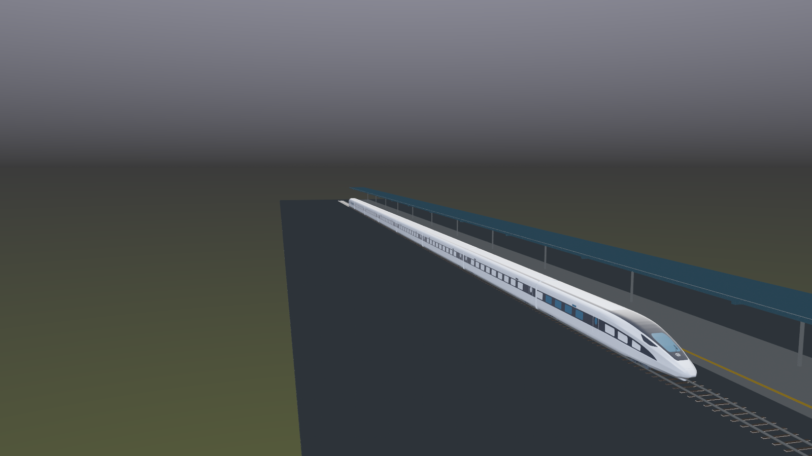
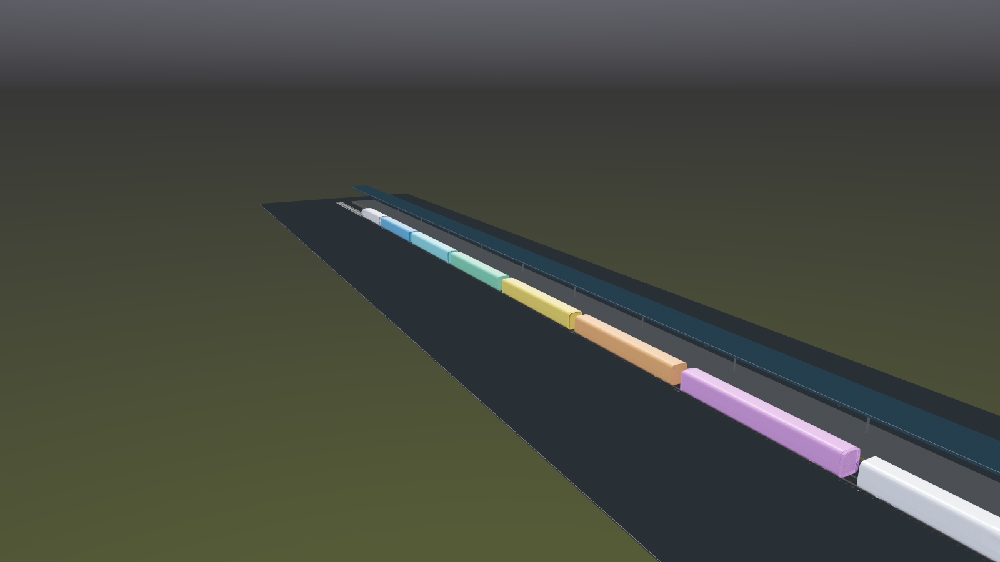

# 复兴号完整编组出厂展示场景

`FinalShowcase` 用于完整利用队员提供的 `复兴号2.fbx`：保留真实列车外形，将列车本体
自动校准到项目尺度，拆成 8 节可独立控制的逻辑车厢，并接入三级 LOD、机位切换、
逐车选择、分解演示和白盒完成流程。它保持为独立生成场景，默认
`EditorBuildSettings` 仍只启用第三人称白盒。

## 当前效果



主预览使用实际 FBX 列车本体、约 200 m 整列长度、280 m 出厂线、长站台、雨棚、
接触网和展示灯光。



彩色图用于核对 7 个车端接口和 8 节车厢范围。场景中的真实网格继续使用原列车
外观；彩色仅表示逻辑归属。

## 模型盘点与拆分结果

固定模型路径：
`Assets/RailCraft/ThirdPerson/Art/Models/FinalShowcase/FuxingTrain.fbx`

- SHA-256：`c5b0f5042eb33ed8cbd895ff7b126dadccccef9e999a7b65e93df79bd2cdd35e`
- 列车本体节点：`空白 > 空白_2`
- 列车本体：99 个网格、1,020,532 顶点、1,922,610 三角面
- 车厢接口：7 个完整截面端板，形成 8 个连续车厢区间
- 分组依据：`FuxingTrain.grouping.json`
- 车厢统计：`FuxingTrain.car-summary.csv`

| 车厢 | 角色 | 网格 | 三角面 |
| --- | --- | ---: | ---: |
| 01 | 头车 A | 20 | 217,779 |
| 02 | 中间车 | 10 | 248,088 |
| 03 | 中间车 | 10 | 248,090 |
| 04 | 中间车 | 10 | 248,089 |
| 05 | 中间车 | 10 | 248,096 |
| 06 | 中间车 | 10 | 248,090 |
| 07 | 中间车 | 10 | 248,091 |
| 08 | 头车 B | 19 | 216,287 |

生成器先记录所有 Renderer 的世界矩阵和包围盒中心，再按车厢边界把 99 个 Renderer
唯一挂到各自的 `CarSegment/VisualRoot_LOD0_HighDetail`。接口端板统一归入源 X 负向
一侧车厢，重挂父节点后会检查世界矩阵，避免拆分引入错位或车端穿插。

## LOD 与实时展示

8 节车各自拥有一个 `LODGroup`，因此远近不同的车厢可以独立降级，分解时 LOD
包围体也会跟随对应车厢移动：

| 层级 | 内容 | 规模 | 切换高度 |
| --- | --- | ---: | ---: |
| LOD0 | 队员原始高模 | 99 Renderer / 1,922,610 面 | 0.70 |
| LOD1 | 每节 5 个车体轮廓代理 | 40 Renderer / 约 480 面 | 0.38 |
| LOD2 | 每节 1 个远景轮廓代理 | 8 Renderer / 约 96 面 | 0.08 |

LOD 使用交叉淡化。近距离镜头保留完整细节，长站台全景和远景会快速降低几何成本。
LOD1/LOD2 当前用于性能兜底；后续若要在中距离保留车头流线和转向架轮廓，可逐节
替换代理网格，`CarSegment`、镜头和交互接口无需调整。

## 展示交互

生成场景会自动配置 `FinalShowcaseRuntimeController`、动态状态栏和选择框：

| 输入 | 功能 |
| --- | --- |
| `F1`～`F4` | 全景、车头、侧面、出发四个机位 |
| `Tab` | 切换到下一个机位 |
| `1`～`8` | 直接选择对应车厢 |
| `←` / `→` 或 `Q` / `E` | 逐节选择车厢 |
| `X` | 展开或复位 8 节编组 |
| `R` | 重置机位、选择和分解状态 |
| `Esc` | 返回第三人称装配工厂 |

侧面机位会跟随当前车厢；分解动画沿纵向拉开车端，同时加入轻微横向错层和抬升，
便于观察每节车的范围。动画只移动车厢视觉根节点，不改写 FBX 源资产。

## 白盒完成流程入口

第三人称白盒结算面板会显示“观看复兴号出厂展示 [V]”。入口同时检查：

1. 当前装配、调试和复测流程已经完成；
2. `FinalShowcase` 场景能够被 Unity 加载。

进入前会保存当前进度。场景缺失或未加入编辑器 Build Settings 时，入口自动隐藏。
Windows 构建脚本检测到 FBX 后会先重建 `FinalShowcase.unity`，再把它作为第二场景
打包，并保持 `ThirdPersonWhitebox` 为启动场景。展示界面右上角按钮或 `Esc` 可返回
工厂。

## 自动摆放与防穿插规则

- 只提取 `空白_2` 列车子树，源文件中的地形、轨道、灯光、天空和摄像机不进入场景；
- 检测总包围盒，源 X 为最长水平轴时绕 Unity Y 轴旋转 90°；
- 按总长度统一缩放到约 200 m，水平居中；
- 将模型最低点对齐到 `RailTopY = 0.32 m`，避免整列沉入道床；
- 删除 FBX 自带的 Camera、Light、AudioSource、Animator 与 Collider；
- 分解/复位从每节车厢记录的基准局部位置插值，不累计位移误差；
- 当前展示场景没有玩家与物理碰撞需求。以后允许玩家贴近列车时，建议每节车增加
  一个 BoxCollider，车头使用 2～3 个简化凸包，继续避免 MeshCollider 的高成本。

## 材质情况

FBX 内有 12 个材质和 10 条纹理引用，其中 3 个图像有嵌入内容。另有 6 项 C4D/HDR
外部预设缺失，路径指向队员电脑。生成器保留 Unity 能正常导入的源材质，并把已知
缺失的车体银色、玻璃、蓝色饰带和深色结构材质映射到项目内 URP 恢复材质，确保场景
不会因失效材质整列变成紫色。缺少授权来源的 Video Copilot/C4D 预设不要直接下载；
最终参赛版本可用自制 PBR 纹理逐项替换。

## 场景生成与层级

- 场景：`Assets/RailCraft/ThirdPerson/Scenes/FinalShowcase.unity`
- 生成器：`Assets/RailCraft/ThirdPerson/Editor/FinalShowcaseSceneBuilder.cs`
- Unity 菜单：`RailCraft > Final Showcase > Rebuild Scene`
- 模型检查：`RailCraft > Final Showcase > Validate Train Model`

```text
FinalShowcaseRoot
├─ Environment / DeparturePlatform
├─ TrainDisplay
│  ├─ FuxingTrain_Normalized
│  ├─ ImportedModelPlacement
│  ├─ CarSegments
│  │  ├─ CarSegment_01_HeadA
│  │  │  ├─ SourceMinusX_End / SourcePlusX_End
│  │  │  └─ VisualRoot_LOD0_HighDetail + LODGroup
│  │  │     ├─ 原始高模 Renderer
│  │  │     ├─ LOD1_Proxy
│  │  │     └─ LOD2_Proxy
│  │  └─ ... CarSegment_08_HeadB
├─ Lighting
├─ CameraComposition
│  ├─ OverviewFocus / HeadCarFocus / SideDetailFocus / DepartureFocus
│  └─ HeroCamera
└─ Interface
   ├─ ShowcaseCanvas
   └─ EventSystem
```

模型缺失或不含可渲染网格时，生成器仍会创建可打开的场景，并用八节低成本占位
编组保留尺度、镜头、交互入口和环境布局；运行时会明确停用无真实视觉根的分解功能。

## 当前验证状态

2026-08-17 已在已激活 Personal 许可证的 Unity 6000.3.21f1 中完成图形化验证：

1. `Validate Train Model` 成功找到并加载 `FuxingTrain.fbx`；
2. FBX 使用 32 位索引，6 个超过 65k 顶点的网格不再被拆成额外 Renderer；
3. `FinalShowcase.unity` 已生成，合同节点确认 99 个 LOD0、40 个 LOD1、8 个 LOD2
   Renderer 和 8 个独立 LODGroup；
4. Play Mode 已显示完整列车、站台环境、HUD 和返回入口，Console 为 0 警告、0 错误；
5. FinalShowcase 相关 EditMode 测试 27/27 通过；完整项目测试为 165/172 通过，另外
   7 项失败集中在既有交互反馈、暂停计时和运行时设置测试；
6. 图形化 Windows 构建成功，产物位于
   `Builds/Whitebox/RailCraftWhitebox.exe`，构建报告为 0 警告、0 错误；
7. Windows 成品内置冒烟流程成功走完 23/23 步，并确认结算页显示
   “观看复兴号出厂展示 [V]”。

旧版 Windows 成品保存在 `Builds/Whitebox.before-finalshowcase-20260817`，便于回退和
画面对照。

生成器会重建整张场景。手工精修内容应放进独立 Prefab，或先复制生成场景，避免
下一次重建覆盖。FBX 受仓库 Git LFS 规则管理。
