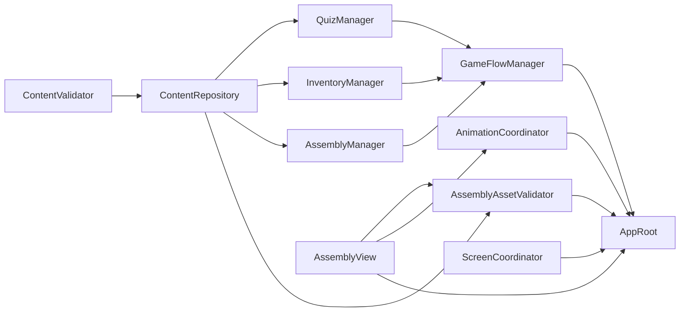

# RailCraft Demo 模块进度

> 需求基线：[`doc/proposal.md`](../proposal.md)  
> 详细设计：[`doc/detailed-design.md`](../detailed-design.md)  
> 使用方式：模块文件内所有任务及完成检查均勾选后，才可勾选本页对应模块。

## 状态规则

- `[ ]`：尚未完成，或仍有任务、测试、文档未完成；
- `[x]`：模块全部最小任务完成，模块完成标准全部满足；
- 每次完成模块任务后，同时更新对应模块文件和本页；
- 任务受阻时，在对应任务行下添加 `阻塞：原因`，不要提前勾选；
- 模块接口发生变化时，先同步 `doc/detailed-design.md`，再继续实施。

## 推荐执行顺序

1. 先执行 `AppRoot` 的工程基础任务 AR-001 至 AR-003；
2. 完成内容校验与内容仓储；AR-004 至 AR-008 的首版数据可同步准备；
3. 并行实现三个纯领域管理器；
4. 完成流程管理器；
5. 完成 3D 表现，并执行 `AssemblyAssetValidator` 的真实资产回归；
6. 完成动画和 UI；
7. 最后执行 AR-009 至 AR-028 的组合、冒烟、构建和交付任务。

## 总体进度

- [x] [`ContentValidator`](content-validator.md)（10/10）
- [x] [`ContentRepository`](content-repository.md)（11/11）
- [x] [`AssemblyAssetValidator`](assembly-asset-validator.md)（8/8）
- [x] [`QuizManager`](quiz-manager.md)（9/9）
- [x] [`InventoryManager`](inventory-manager.md)（7/7）
- [x] [`AssemblyManager`](assembly-manager.md)（12/12）
- [x] [`GameFlowManager`](game-flow-manager.md)（15/15）
- [x] [`AssemblyView`](assembly-view.md)（21/21，含 `PartActor`、9 个零件场景和已确认 GUI 视口验收）
- [x] [`AnimationCoordinator`](animation-coordinator.md)（11/11）
- [x] [`ScreenCoordinator`](screen-coordinator.md)（13/13，含全部页面、8 状态映射和双分辨率布局测试）
- [ ] [`AppRoot`](app-root.md)（27/28，仅待发布分支最终 Actions 验证、合并和交付引用确认）

## 模块依赖

## 文件所有权

| 模块 | 主要负责路径 |
|---|---|
| `ContentValidator` | `scripts/infrastructure/content_validator.gd`、`validation_issue.gd`、对应测试 |
| `ContentRepository` | `scripts/infrastructure/content_repository.gd`、内容 DTO、`ContentCatalog`、对应测试 |
| `AssemblyAssetValidator` | `scripts/infrastructure/assembly_asset_validator.gd`、对应测试夹具 |
| `QuizManager` | `scripts/domain/quiz_manager.gd`、答题结果类型、对应测试 |
| `InventoryManager` | `scripts/domain/inventory_manager.gd`、奖励结果类型、对应测试 |
| `AssemblyManager` | `scripts/domain/assembly_manager.gd`、安装结果类型、对应测试 |
| `GameFlowManager` | `scripts/flow/game_flow_manager.gd`、流程测试假对象 |
| `AssemblyView` | `assembly_view.gd`、`part_actor.gd`、装配及零件场景 |
| `AnimationCoordinator` | `animation_coordinator.gd`、动画集成测试 |
| `ScreenCoordinator` | `screen_coordinator.gd`、各 UI 页面脚本与场景、主题 |
| `AppRoot` | `app_root.gd`、`main.tscn`、`project.godot`、工程级集成配置 |

共享文件需要由当前任务明确修改，完成后检查其他模块契约是否仍成立。

## 项目完成检查

- [ ] 11 个模块全部完成；
- [x] `uv run gdformat --check .` 通过；
- [x] `uv run gdlint .` 通过；
- [x] Godot headless 导入和主场景加载通过；
- [x] GUT 全部测试通过；
- [x] Windows x64 20 项验收通过；
- [x] GitHub Actions 质量与 Windows 构建工作流通过；
- [x] README、运行说明、开发说明、来源清单、验收记录和版本说明完成；
- [ ] 私有仓库及构建产物完成最终交付引用确认。

## 当前证据

- PR #1 已 squash 合并到 `main`，合并提交：`47f55f5755d28de5b925437f20a1a1be0ae1c41f`；
- Quality run `29676812007`：固定工具链、格式、lint、Godot 导入、主场景加载和 107 个 GUT 测试全部通过；
- Build Windows run `29676812156`：导出、PE 校验、文件大小、SHA-256、ZIP 与 artifact 上传通过；
- Actions artifact：`be8d66a16896827bb9802415247572f0804ffa74c9b3e2ebd7d86bf13c4da039`；
- 内层 ZIP：`f9cd1f226ac6e6709e96ef0219c83036d0356687223e72bdfe02fb968f49be1d`；
- EXE：`846e20935e32c76ae86e94a314c8132a44f11dc12b2d0c88ee3da9543466aeb7`；
- 20 项验收记录：[`../acceptance/windows-v0.1.0-demo.md`](../acceptance/windows-v0.1.0-demo.md)；
- 版本说明：[`../releases/v0.1.0-demo.md`](../releases/v0.1.0-demo.md)。

## 当前阻塞

- 发布分支需要通过最终一轮 Quality 与 Windows Build；
- 通过后合并发布分支，并确认最终构建 artifact 或 GitHub Release 下载入口。
