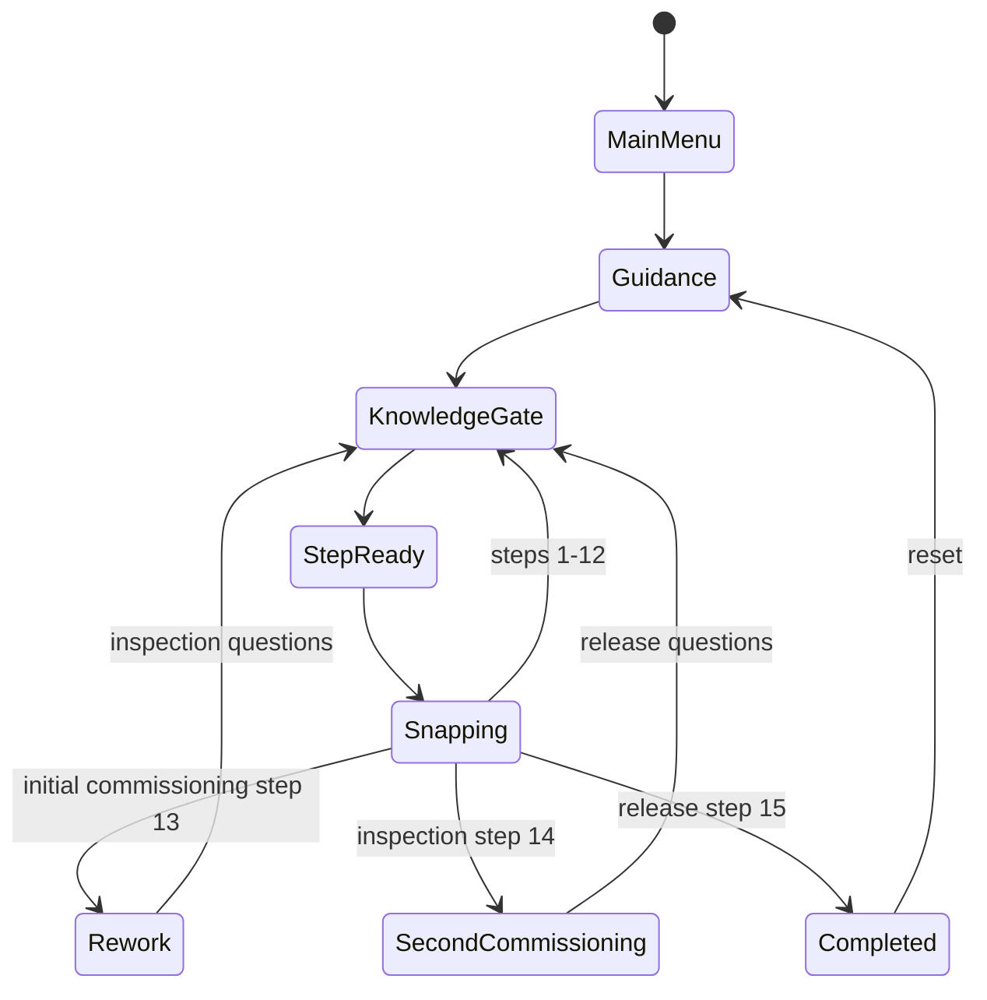

# RailCraft Unity v0.1 Implementation Plan

> **状态：已完成并冻结。** 本文是 2026-08-01 固定视角 Unity v0.1 的历史实施计划，
> 保留当时的约束、命令和任务拆分用于审计。当前开发范围以
> `apps/railcraft-unity/Documentation/ThirdPersonWhitebox.md` 为准。

> **For agentic workers:** REQUIRED SUB-SKILL: Use superpowers:subagent-driven-development (recommended) or superpowers:executing-plans to implement this plan task-by-task. Steps use checkbox (`- [ ]`) syntax for tracking.

**Goal:** Build a Windows-only Unity demonstration in which the player answers the fixed 48-question bank and completes a guided, subsystem-level SWM-400E1 powered-bogie assembly flow through carbody lowering, commissioning, inspection, rework, and release to service.

**Architecture:** The Unity project uses data-driven content for questions and process order, plain C# domain objects for deterministic flow rules, MonoBehaviour adapters for uGUI and 3D interaction, and a ScriptableObject catalog for replaceable model prefabs. Runtime model IDs, drop-target IDs, and process-step IDs remain stable while placeholder meshes are replaced by teammate-delivered assets.

**Tech Stack:** Unity Editor `6000.3.21f1` / Unity 6.3 LTS, Universal Render Pipeline `17.3.x` supplied by the editor template, Input System `1.17.0`, uGUI, C#, Unity Test Framework, Windows x86_64.

## Global Constraints

- The executable target is Windows x86_64 only.
- Use Unity Editor `6000.3.21f1`; commit `ProjectSettings/ProjectVersion.txt` and `Packages/packages-lock.json`.
- Use URP and Linear color space. Do not mix HDRP, Built-in Render Pipeline, UI Toolkit, or another input framework into v0.1.
- The interactive vehicle context is CR400AF and the interactive bogie is the SWM-400E1 powered bogie.
- SWT-400E1 trailer-bogie content is reserved for a later version.
- The setting is a train manufacturing factory.
- The interactive carbody is a simplified powered intermediate car; a CR400AF-style head car is used as a static background/final hero-view element.
- Implement guided assembly only. Do not add free assembly.
- Use keyboard and mouse only.
- The camera can orbit, pan, and zoom. Draggable parts keep a fixed authored rotation and expose no rotation controls.
- The only progress-changing 3D interaction is drag and drop.
- Assembly depth is subsystem level. Do not implement bolts, torque tools, fit tolerances, or individual fasteners.
- Complete the macro flow: powered-bogie subsystem assembly, carbody lowering, commissioning, rework, inspection, second commissioning, and release to service.
- The commissioning failure is a clearly labeled teaching placeholder. It must not be presented as a verified SWM-400E1 fault.
- Use the teammate's process diagram as a provisional sequence that can be replaced through JSON.
- Use all 48 fixed questions from `50道选择+30道判断.doc`: 40 multiple-choice and 8 true/false.
- Preserve question wording, options, and correct answers in v0.1.
- Do not display citations or source fields for the question bank.
- Wrong answers allow retry. Correct completion unlocks the current drag step.
- Do not calculate or display score, accuracy, grade, ranking, or knowledge mastery.
- Do not implement save, continue, accounts, networking, analytics, audio, Android, XR, touch controls, or multiplayer.
- Include start, guidance, settings limited to graphics/window mode, reset flow, and exit.
- Runtime content is fully local and must not require a network connection.
- Placeholder or public low-poly models are allowed. Engineering dimensions and vehicle-specific geometry must come from the responsible teammate or a verified technical source.
- The supplied `wheel.SLDPRT` remains a candidate source asset until its dimensions and SWM-400E1 applicability are confirmed.
- UI language is Simplified Chinese.
- Track source code, optimized runtime assets, tests, manifests, and review images. Keep raw delivery binaries under ignored `deliveries/**/release/**`.
- Current execution defaults to inline work. Subagents require an explicit user request.

---

## Frozen Product Flow

The first complete run uses the following 15 content steps. All draggable roots keep their authored rotation.

| Order | Step ID | Display name | Drag item | Drop target | Assigned question count |
|---:|---|---|---|---|---:|
| 1 | `frame_module` | 构架模块就位 | 构架模块 | 装配工位基准 | 4 |
| 2 | `wheelset_axlebox_a` | A端轮对轴箱模块 | 轮对、轴承与轴箱组合模块 | 构架A端接口 | 3 |
| 3 | `wheelset_axlebox_b` | B端轮对轴箱模块 | 轮对、轴承与轴箱组合模块 | 构架B端接口 | 3 |
| 4 | `primary_suspension` | 一系悬挂模块 | 弹性、定位与减振组合模块 | 一系悬挂接口 | 3 |
| 5 | `brake_module` | 制动模块 | 子系统级制动模块 | 构架制动接口 | 3 |
| 6 | `traction_drive_a` | A端牵引驱动模块 | 牵引电机与齿轮箱组合模块 | 构架A端驱动接口 | 3 |
| 7 | `traction_drive_b` | B端牵引驱动模块 | 牵引电机与齿轮箱组合模块 | 构架B端驱动接口 | 3 |
| 8 | `central_traction` | 中央牵引装置 | 中央牵引组合模块 | 构架中央接口 | 3 |
| 9 | `secondary_suspension` | 二系悬挂模块 | 空气弹簧等弹性元件组合 | 车体支承接口 | 3 |
| 10 | `height_damping` | 高度控制与减振模块 | 高度控制、横向及抗蛇行减振组合 | 二系悬挂接口 | 3 |
| 11 | `sensor_module` | 传感器模块 | 子系统级传感器组合 | 构架传感器接口 | 3 |
| 12 | `carbody_lowering` | 车体落车 | 简化动力中间车车体 | 完成的动力转向架 | 3 |
| 13 | `commissioning` | 初次调试 | 调试任务卡 | 调试控制台 | 4 |
| 14 | `inspection` | 整改与检验 | 检验任务卡 | 检验工位 | 4 |
| 15 | `release` | 投入使用 | 放行任务卡 | 放行看板 | 3 |

Question allocation is deterministic and consumes the source order:

```text
frame_module          q001-q004
wheelset_axlebox_a    q005-q007
wheelset_axlebox_b    q008-q010
primary_suspension    q011-q013
brake_module          q014-q016
traction_drive_a      q017-q019
traction_drive_b      q020-q022
central_traction      q023-q025
secondary_suspension  q026-q028
height_damping        q029-q031
sensor_module         q032-q034
carbody_lowering      q035-q037
commissioning         q038-q041
inspection            q042-q045
release               q046-q048
```

The UI labels these as the current stage's “知识准备题”. It does not claim that every mixed-domain question describes the exact physical operation.

The commissioning loop is deterministic:

```text
initial commissioning
→ teaching-placeholder sensor signal anomaly
→ rework instruction
→ inspection
→ second commissioning, no repeated questions
→ pass
→ release to service
```

The anomaly copy is fixed to:

```text
教学占位异常：检测到传感器信号不一致。该内容用于演示“调试—整改—检验—再调试”闭环，不代表 SWM-400E1 的真实故障结论。
```

## Runtime State Sequence



## File Map

```text
apps/railcraft-unity/
├─ Assets/
│  └─ RailCraft/
│     ├─ Art/
│     │  ├─ Materials/
│     │  ├─ Models/
│     │  │  ├─ Placeholders/
│     │  │  └─ Production/Bogie/
│     │  ├─ Prefabs/
│     │  │  ├─ Modules/
│     │  │  ├─ Process/
│     │  │  └─ Vehicles/
│     │  └─ UI/
│     ├─ Content/V1/
│     │  ├─ questions.v1.json
│     │  └─ flow.v1.json
│     ├─ Input/RailCraftControls.inputactions
│     ├─ Scenes/Bootstrap.unity
│     ├─ Scenes/Factory.unity
│     ├─ Scripts/
│     │  ├─ Assets/
│     │  ├─ Camera/
│     │  ├─ Content/
│     │  ├─ Flow/
│     │  ├─ Interaction/
│     │  ├─ Presentation/
│     │  └─ Process/
│     ├─ Editor/
│     └─ Tests/
│        ├─ EditMode/
│        └─ PlayMode/
├─ Documentation/
│  ├─ Scope.md
│  ├─ ModelHandoff.md
│  └─ Acceptance.md
├─ Packages/
├─ ProjectSettings/
└─ README.md
```

The existing Godot project remains under `apps/railcraft-godot/` as a reference implementation. Unity code does not load Godot scenes, scripts, or `res://` paths.

Primary source inputs:

```text
deliveries/research/cr400af-bogie-v1/README.md
deliveries/research/cr400af-bogie-v1/release/high-speed-emu-bogies-2023.pdf
deliveries/models/swm-400e1-wheel-v1/README.md
deliveries/models/swm-400e1-wheel-v1/release/wheel.SLDPRT
deliveries/content/question-bank-v1/README.md
deliveries/content/question-bank-v1/release/question-bank.doc
deliveries/process/swm400e1-guided-flow-v1/README.md
deliveries/process/swm400e1-guided-flow-v1/release/process-diagram.png
```

The public bogie paper supports subsystem names and the SWM-400E1 visual reference. It does not define the provisional game sequence as a factory work instruction.

---

### Task 1: Create and pin the Unity project

**Files:**
- Create: `apps/railcraft-unity/ProjectSettings/ProjectVersion.txt`
- Create: `apps/railcraft-unity/Packages/manifest.json`
- Create: `apps/railcraft-unity/Packages/packages-lock.json`
- Create: `apps/railcraft-unity/Assets/RailCraft/Scripts/RailCraft.Runtime.asmdef`
- Create: `apps/railcraft-unity/Assets/RailCraft/Tests/EditMode/RailCraft.EditModeTests.asmdef`
- Create: `apps/railcraft-unity/Assets/RailCraft/Tests/EditMode/ProjectConfigurationTests.cs`
- Create: `apps/railcraft-unity/Assets/RailCraft/Editor/ProjectConfigurator.cs`
- Create: `apps/railcraft-unity/README.md`
- Modify: `.gitignore`
- Modify: `.gitattributes`

**Interfaces:**
- Consumes: Unity Editor `6000.3.21f1` installed at `C:\Program Files\Unity 6000.3.21f1`, plus Windows Build Support (IL2CPP).
- Produces: a URP project that opens without migration, a runtime assembly named `RailCraft.Runtime`, and a callable `RailCraft.Editor.ProjectConfigurator.Apply()` method.

- [ ] **Step 1: Install the pinned editor and create the project**

Install `6000.3.21f1` with “Windows Build Support (IL2CPP)” and create a Universal 3D project at:

```text
<仓库根目录>\apps\railcraft-unity
```

After creation, verify:

```powershell
$Project = (Resolve-Path '.\apps\railcraft-unity').Path
Get-Content "$Project\ProjectSettings\ProjectVersion.txt"
```

Expected:

```text
m_EditorVersion: 6000.3.21f1
```

- [ ] **Step 2: Pin required packages**

Set these direct dependencies in `Packages/manifest.json`, retaining template-generated URP support packages:

```json
{
  "dependencies": {
    "com.unity.inputsystem": "1.17.0",
    "com.unity.render-pipelines.universal": "17.3.0",
    "com.unity.test-framework": "1.4.3",
    "com.unity.ugui": "2.0.0"
  }
}
```

Open the project once and allow Unity to resolve `packages-lock.json`. If the editor supplies a newer `17.3.x` URP patch tied to `6000.3.21f1`, retain the editor-resolved patch and record it in `README.md`; do not change the `17.3` major/minor line.

- [ ] **Step 3: Write the failing project configuration test**

Create `ProjectConfigurationTests.cs`:

```csharp
using NUnit.Framework;
using UnityEditor;
using UnityEngine;

namespace RailCraft.Tests.EditMode
{
    public sealed class ProjectConfigurationTests
    {
        [Test]
        public void ProjectTargetsWindowsLinearColorSpace()
        {
            Assert.That(PlayerSettings.colorSpace, Is.EqualTo(ColorSpace.Linear));
            Assert.That(EditorUserBuildSettings.activeBuildTarget,
                Is.EqualTo(BuildTarget.StandaloneWindows64));
            Assert.That(PlayerSettings.productName, Is.EqualTo("RailCraft"));
            Assert.That(PlayerSettings.companyName, Is.EqualTo("RailCraft Team"));
        }
    }
}
```

- [ ] **Step 4: Run the test and verify the initial failure**

```powershell
$UnityExe = 'C:\Program Files\Unity 6000.3.21f1\Editor\Unity.exe'
$Project = (Resolve-Path '.\apps\railcraft-unity').Path
& $UnityExe -batchmode -nographics -quit `
  -projectPath $Project `
  -runTests -testPlatform EditMode `
  -testResults "$Project\TestResults\editmode.xml"
```

Expected: non-zero exit or a failed assertion for product/company/build target.

- [ ] **Step 5: Implement the project configurator**

Create `ProjectConfigurator.cs`:

```csharp
using UnityEditor;
using UnityEngine;

namespace RailCraft.Editor
{
    public static class ProjectConfigurator
    {
        [MenuItem("RailCraft/Apply Project Configuration")]
        public static void Apply()
        {
            PlayerSettings.companyName = "RailCraft Team";
            PlayerSettings.productName = "RailCraft";
            PlayerSettings.colorSpace = ColorSpace.Linear;
            PlayerSettings.defaultScreenWidth = 1920;
            PlayerSettings.defaultScreenHeight = 1080;
            PlayerSettings.fullScreenMode = FullScreenMode.Windowed;
            EditorUserBuildSettings.SwitchActiveBuildTarget(
                BuildTargetGroup.Standalone,
                BuildTarget.StandaloneWindows64);
            AssetDatabase.SaveAssets();
        }
    }
}
```

Run it once from `RailCraft > Apply Project Configuration`.

- [ ] **Step 6: Add repository rules and rerun the test**

Append to `.gitignore`:

```gitignore
apps/railcraft-unity/[Ll]ibrary/
apps/railcraft-unity/[Tt]emp/
apps/railcraft-unity/[Oo]bj/
apps/railcraft-unity/[Ll]ogs/
apps/railcraft-unity/[Uu]ser[Ss]ettings/
apps/railcraft-unity/TestResults/
apps/railcraft-unity/Builds/
```

Append to `.gitattributes`:

```gitattributes
*.fbx filter=lfs diff=lfs merge=lfs -text
*.blend filter=lfs diff=lfs merge=lfs -text
*.step filter=lfs diff=lfs merge=lfs -text
*.x_t filter=lfs diff=lfs merge=lfs -text
```

Rerun the EditMode command. Expected: all project configuration tests pass.

- [ ] **Step 7: Commit the pinned project**

```powershell
git add .gitignore .gitattributes apps/railcraft-unity
git commit -m "build: scaffold pinned Unity 6.3 project"
```

---

### Task 2: Archive and freeze the fixed question bank

**Files:**
- Modify: `deliveries/content/question-bank-v1/README.md`
- Create: `deliveries/content/question-bank-v1/review/question-bank.txt`
- Verify existing ignored delivery: `deliveries/content/question-bank-v1/release/question-bank.doc`
- Create: `apps/railcraft-unity/Assets/RailCraft/Content/V1/questions.v1.json`
- Create: `apps/railcraft-unity/Assets/RailCraft/Tests/EditMode/QuestionBankBaselineTests.cs`

**Interfaces:**
- Consumes: `deliveries/content/question-bank-v1/release/question-bank.doc`；原始来源与校验值见同目录 README。
- Produces: immutable question IDs `q001` through `q048` in source order.

- [ ] **Step 1: Verify the archived source and checksum**

Verify the archived `.doc` against the manifest value `45F94190C8486DC78A74994C7120A81C0949331E67956A2751B1A3450C9C0C70`. Retain the original path, byte length, received date, and observed count mismatch in `README.md`.

The manifest must state:

```text
文件名声称包含50道选择题和30道判断题；本次逐页核对得到40道选择题和8道判断题，共48题。v0.1以实际48题为冻结内容。
```

- [ ] **Step 2: Create the UTF-8 review transcription**

Export all visible text from the 12-page source into `question-bank.txt`. Preserve:

```text
题号
题干
全部选项
正确答案
选择题/判断题类型
```

Do not copy page headers, page numbers, author metadata, or source citations into runtime content.

- [ ] **Step 3: Write the failing baseline test**

Create `QuestionBankBaselineTests.cs`:

```csharp
using System.IO;
using NUnit.Framework;
using UnityEngine;

namespace RailCraft.Tests.EditMode
{
    public sealed class QuestionBankBaselineTests
    {
        [Test]
        public void FrozenQuestionBankContainsFortyChoiceAndEightTrueFalse()
        {
            var path = Path.Combine(
                Application.dataPath,
                "RailCraft/Content/V1/questions.v1.json");
            var json = File.ReadAllText(path);
            var bank = JsonUtility.FromJson<QuestionBankFile>(json);

            Assert.That(bank.schemaVersion, Is.EqualTo(1));
            Assert.That(bank.contentVersion, Is.EqualTo("questions-2026-07-v1"));
            Assert.That(bank.questions.Length, Is.EqualTo(48));
            Assert.That(bank.questions, Has.Exactly(40)
                .Matches<QuestionRecord>(q => q.type == "single_choice"));
            Assert.That(bank.questions, Has.Exactly(8)
                .Matches<QuestionRecord>(q => q.type == "true_false"));
            Assert.That(bank.questions[0].id, Is.EqualTo("q001"));
            Assert.That(bank.questions[47].id, Is.EqualTo("q048"));
        }

        [System.Serializable]
        private sealed class QuestionBankFile
        {
            public int schemaVersion;
            public string contentVersion;
            public QuestionRecord[] questions;
        }

        [System.Serializable]
        private sealed class QuestionRecord
        {
            public string id;
            public string type;
            public string prompt;
            public string[] options;
            public int correctOptionIndex;
        }
    }
}
```

- [ ] **Step 4: Run the test and verify it fails**

Run the Task 1 EditMode command. Expected: failure because `questions.v1.json` is missing.

- [ ] **Step 5: Transcribe the JSON**

Use this exact root and record shape:

```json
{
  "schemaVersion": 1,
  "contentVersion": "questions-2026-07-v1",
  "questions": [
    {
      "id": "q001",
      "type": "single_choice",
      "prompt": "原题题干",
      "options": ["A选项", "B选项", "C选项", "D选项"],
      "correctOptionIndex": 0
    }
  ]
}
```

For true/false questions, use:

```json
{
  "id": "q041",
  "type": "true_false",
  "prompt": "原题题干",
  "options": ["正确", "错误"],
  "correctOptionIndex": 0
}
```

Use zero-based `correctOptionIndex`. Preserve the document's original answer even if technical review raises a concern; record concerns in the delivery manifest for the next version.

- [ ] **Step 6: Verify the frozen baseline**

Run the EditMode command. Expected: the baseline test passes with 48 total, 40 choice, and 8 true/false.

- [ ] **Step 7: Commit content and manifest**

```powershell
git add deliveries/content/question-bank-v1 apps/railcraft-unity/Assets/RailCraft/Content/V1 apps/railcraft-unity/Assets/RailCraft/Tests/EditMode
git commit -m "content: freeze v0.1 question bank"
```

---

### Task 3: Define and validate runtime content contracts

**Files:**
- Create: `apps/railcraft-unity/Assets/RailCraft/Scripts/Content/QuestionDefinition.cs`
- Create: `apps/railcraft-unity/Assets/RailCraft/Scripts/Content/StepDefinition.cs`
- Create: `apps/railcraft-unity/Assets/RailCraft/Scripts/Content/FlowDefinition.cs`
- Create: `apps/railcraft-unity/Assets/RailCraft/Scripts/Content/ContentBundle.cs`
- Create: `apps/railcraft-unity/Assets/RailCraft/Scripts/Content/ContentLoadException.cs`
- Create: `apps/railcraft-unity/Assets/RailCraft/Scripts/Content/JsonContentRepository.cs`
- Create: `apps/railcraft-unity/Assets/RailCraft/Scripts/Content/ContentValidator.cs`
- Create: `apps/railcraft-unity/Assets/RailCraft/Content/V1/flow.v1.json`
- Modify: `deliveries/process/swm400e1-guided-flow-v1/README.md`
- Verify existing ignored delivery: `deliveries/process/swm400e1-guided-flow-v1/release/process-diagram.png`
- Create: `apps/railcraft-unity/Assets/RailCraft/Tests/EditMode/Fixtures/ContentFixture.cs`
- Create: `apps/railcraft-unity/Assets/RailCraft/Tests/EditMode/ContentValidatorTests.cs`

**Interfaces:**
- Consumes: `questions.v1.json`, `flow.v1.json`.
- Produces: `ContentBundle JsonContentRepository.Load(string questionJson, string flowJson)` and `IReadOnlyList<string> ContentValidator.Validate(ContentBundle bundle)`.
- Test fixture: `ContentFixture.CreateValid()` returns a mutable valid in-memory bundle and `ContentFixture.LoadProduction()` loads the committed production JSON.

- [ ] **Step 1: Verify and annotate the teammate process diagram**

Verify the archived PNG against the manifest value `D94163B006F1B3C9A7946A8D80E3A3AC537104098928B00F6EE145B2C93C8EF7`. The manifest must preserve these user clarifications:

```text
车型平台：CR400AF
首版动力转向架：SWM-400E1
拖车转向架 SWT-400E1：后续版本
左侧“构架”：制造输入件/零部件模块
中部“转向架构体”：组装完成后的转向架主体结构
范围：子系统级装配
结尾：车体落车、调试、检验、投入使用
流程性质：v0.1教学占位流程，后续由负责成员替换
```

- [ ] **Step 2: Write failing content validation tests**

Create `ContentValidatorTests.cs` with these cases:

```csharp
[Test]
public void ValidBundleUsesEveryQuestionExactlyOnce()
{
    var issues = ContentValidator.Validate(ContentFixture.CreateValid());
    Assert.That(issues, Is.Empty);
}

[Test]
public void DuplicateQuestionAssignmentIsRejected()
{
    var bundle = ContentFixture.CreateValid();
    bundle.Flow.steps[1].questionIds[0] = "q001";
    var issues = ContentValidator.Validate(bundle);
    Assert.That(issues, Does.Contain("question_duplicate:q001"));
}

[Test]
public void EveryStepRequiresAtLeastOneQuestion()
{
    var bundle = ContentFixture.CreateValid();
    bundle.Flow.steps[3].questionIds = System.Array.Empty<string>();
    var issues = ContentValidator.Validate(bundle);
    Assert.That(issues, Does.Contain("step_without_questions:primary_suspension"));
}

[Test]
public void FlowContainsExactlyFifteenOrderedSteps()
{
    var bundle = ContentFixture.CreateValid();
    Assert.That(bundle.Flow.steps.Length, Is.EqualTo(15));
    Assert.That(bundle.Flow.steps[0].id, Is.EqualTo("frame_module"));
    Assert.That(bundle.Flow.steps[14].id, Is.EqualTo("release"));
}
```

- [ ] **Step 3: Run tests and verify compile failures**

Run the EditMode command. Expected: compilation fails because content types do not exist.

- [ ] **Step 4: Implement serializable content types**

Use these signatures:

```csharp
[System.Serializable]
public sealed class QuestionDefinition
{
    public string id;
    public string type;
    public string prompt;
    public string[] options;
    public int correctOptionIndex;
}

[System.Serializable]
public sealed class StepDefinition
{
    public string id;
    public int order;
    public string displayName;
    public string phase;
    public string assetKey;
    public string dropTargetId;
    public string[] questionIds;
}

[System.Serializable]
public sealed class FlowDefinition
{
    public int schemaVersion;
    public string contentVersion;
    public bool failFirstCommissioning;
    public StepDefinition[] steps;
}

public sealed class ContentBundle
{
    public QuestionDefinition[] Questions { get; }
    public FlowDefinition Flow { get; }

    public ContentBundle(QuestionDefinition[] questions, FlowDefinition flow)
    {
        Questions = questions;
        Flow = flow;
    }
}

public sealed class ContentLoadException : System.Exception
{
    public ContentLoadException(string message) : base(message) { }
}
```

- [ ] **Step 5: Implement JSON loading**

`JsonContentRepository.Load` must:

1. Reject blank inputs with `ContentLoadException`.
2. Deserialize the two top-level wrappers with `JsonUtility`.
3. Return a `ContentBundle`.
4. Never read from the network or write user data.

Use this public signature:

```csharp
public static ContentBundle Load(string questionJson, string flowJson)
```

- [ ] **Step 6: Implement exact validation rules**

`ContentValidator.Validate` returns issue codes in ordinal order:

```text
question_count
question_id_missing
question_id_duplicate
question_option_count
question_answer_out_of_range
step_count
step_order
step_id_missing
step_id_duplicate
step_without_questions
step_question_missing
question_duplicate
question_unassigned
asset_key_missing
drop_target_missing
```

It must require 48 questions, 15 steps, unique IDs, two options for true/false, at least two options for choice, valid answer indices, and exactly one assignment for every question.

- [ ] **Step 7: Create the frozen flow JSON**

Set:

```json
{
  "schemaVersion": 1,
  "contentVersion": "swm400e1-guided-flow-2026-08-v1",
  "failFirstCommissioning": true,
  "steps": [
    {
      "id": "frame_module",
      "order": 1,
      "displayName": "构架模块就位",
      "phase": "bogie_assembly",
      "assetKey": "module.frame",
      "dropTargetId": "target.frame",
      "questionIds": ["q001", "q002", "q003", "q004"]
    }
  ]
}
```

Add the remaining 14 rows exactly as listed in “Frozen Product Flow” and assign the frozen ranges shown above.

- [ ] **Step 8: Run validation tests**

Run the EditMode command. Expected: all content tests pass and no issue code is returned for the production JSON.

- [ ] **Step 9: Commit**

```powershell
git add deliveries/process/swm400e1-guided-flow-v1 apps/railcraft-unity/Assets/RailCraft/Scripts/Content apps/railcraft-unity/Assets/RailCraft/Content/V1 apps/railcraft-unity/Assets/RailCraft/Tests/EditMode
git commit -m "feat: add validated data-driven content contracts"
```

---

### Task 4: Implement the deterministic guided-flow domain

**Files:**
- Create: `apps/railcraft-unity/Assets/RailCraft/Scripts/Flow/FlowPhase.cs`
- Create: `apps/railcraft-unity/Assets/RailCraft/Scripts/Flow/AnswerResult.cs`
- Create: `apps/railcraft-unity/Assets/RailCraft/Scripts/Flow/DropDecision.cs`
- Create: `apps/railcraft-unity/Assets/RailCraft/Scripts/Flow/FlowSnapshot.cs`
- Create: `apps/railcraft-unity/Assets/RailCraft/Scripts/Flow/GuidedFlowMachine.cs`
- Create: `apps/railcraft-unity/Assets/RailCraft/Tests/EditMode/Fixtures/FlowFixture.cs`
- Create: `apps/railcraft-unity/Assets/RailCraft/Tests/EditMode/GuidedFlowMachineTests.cs`

**Interfaces:**
- Consumes: a validated `ContentBundle`.
- Produces: `GuidedFlowMachine`, `FlowSnapshot Snapshot`, `void StartNewRun()`, `void ConfirmGuidance()`, `AnswerResult SubmitAnswer(int optionIndex)`, `DropDecision ConfirmDrop(string stepId)`, `void ConfirmSnapAnimation()`, `void ConfirmReworkAcknowledged()`, `void CompleteSecondCommissioning()`, and `void Reset()`.
- Test fixture: `FlowFixture` creates a valid machine at the first gate, first unlocked step, or initial commissioning and exposes `WrongOption(GuidedFlowMachine)` plus `AnswerCurrentStepCorrectly(GuidedFlowMachine)`.

- [ ] **Step 1: Write failing state-machine tests**

Create tests for these exact behaviors:

```csharp
[Test]
public void CorrectAnswersUnlockOnlyTheCurrentStep()
{
    var machine = FlowFixture.StartAtFirstKnowledgeGate();
    AnswerEveryQuestionCorrectly(machine);
    Assert.That(machine.Snapshot.Phase, Is.EqualTo(FlowPhase.StepReady));
    Assert.That(machine.Snapshot.CurrentStepId, Is.EqualTo("frame_module"));
}

[Test]
public void WrongAnswerDoesNotAdvanceQuestionIndex()
{
    var machine = FlowFixture.StartAtFirstKnowledgeGate();
    var before = machine.Snapshot.QuestionIndex;
    var result = machine.SubmitAnswer(FlowFixture.WrongOption(machine));
    Assert.That(result.IsCorrect, Is.False);
    Assert.That(machine.Snapshot.QuestionIndex, Is.EqualTo(before));
}

[Test]
public void WrongDropIsRejectedWithoutChangingStep()
{
    var machine = FlowFixture.UnlockFirstStep();
    var decision = machine.ConfirmDrop("wheelset_axlebox_a");
    Assert.That(decision.Accepted, Is.False);
    Assert.That(decision.Code, Is.EqualTo("wrong_step"));
    Assert.That(machine.Snapshot.CurrentStepId, Is.EqualTo("frame_module"));
}

[Test]
public void FirstCommissioningFailsThenLoopPasses()
{
    var machine = FlowFixture.ReachInitialCommissioning();
    machine.ConfirmDrop("commissioning");
    machine.ConfirmSnapAnimation();
    Assert.That(machine.Snapshot.Phase, Is.EqualTo(FlowPhase.Rework));

    machine.ConfirmReworkAcknowledged();
    FlowFixture.AnswerCurrentStepCorrectly(machine);
    machine.ConfirmDrop("inspection");
    machine.ConfirmSnapAnimation();
    Assert.That(machine.Snapshot.Phase, Is.EqualTo(FlowPhase.SecondCommissioning));

    machine.CompleteSecondCommissioning();
    Assert.That(machine.Snapshot.Phase, Is.EqualTo(FlowPhase.KnowledgeGate));
    Assert.That(machine.Snapshot.CurrentStepId, Is.EqualTo("release"));
}

[Test]
public void ResetClearsProgressWithoutPersistence()
{
    var machine = FlowFixture.UnlockFirstStep();
    machine.Reset();
    Assert.That(machine.Snapshot.Phase, Is.EqualTo(FlowPhase.Guidance));
    Assert.That(machine.Snapshot.StepIndex, Is.EqualTo(0));
    Assert.That(machine.Snapshot.CommissioningAttempt, Is.EqualTo(0));
}
```

- [ ] **Step 2: Run tests and verify compile failures**

Run the EditMode command. Expected: compilation fails for missing flow types.

- [ ] **Step 3: Implement state values**

Define:

```csharp
public enum FlowPhase
{
    MainMenu,
    Guidance,
    KnowledgeGate,
    StepReady,
    Snapping,
    Rework,
    SecondCommissioning,
    Completed
}
```

`FlowSnapshot` exposes read-only properties:

```csharp
public FlowPhase Phase { get; }
public int StepIndex { get; }
public int QuestionIndex { get; }
public string CurrentStepId { get; }
public int CommissioningAttempt { get; }
```

- [ ] **Step 4: Implement question and drop transitions**

Rules:

```text
StartNewRun: MainMenu → Guidance
ConfirmGuidance: Guidance → KnowledgeGate
correct answer: advance within current step
last correct answer: KnowledgeGate → StepReady
wrong answer: stay in KnowledgeGate
correct current drop: StepReady → Snapping
wrong step ID: stay in StepReady
snap completion for steps 1-12: next step → KnowledgeGate
snap completion for commissioning step 13: Rework
rework acknowledgement: inspection step 14 → KnowledgeGate
inspection step 14 snap completion: SecondCommissioning
second commissioning completion: release step 15 → KnowledgeGate
release step 15 snap completion: Completed
```

`AnswerResult` contains `IsCorrect`, `QuestionId`, and `CorrectOptionIndex`. It contains no score fields.

- [ ] **Step 5: Implement the process loop**

The first commissioning result uses `failFirstCommissioning=true`, increments `CommissioningAttempt` to 1, and enters `Rework`. Rework acknowledgement opens the inspection knowledge gate. Snapping the inspection card enters `SecondCommissioning`. Completing the second commissioning increments the attempt to 2 and opens the release knowledge gate. Snapping the release card enters `Completed`.

- [ ] **Step 6: Run the domain tests**

Run the EditMode command. Expected: all guided-flow tests pass.

- [ ] **Step 7: Commit**

```powershell
git add apps/railcraft-unity/Assets/RailCraft/Scripts/Flow apps/railcraft-unity/Assets/RailCraft/Tests/EditMode
git commit -m "feat: implement guided assembly state machine"
```

---

### Task 5: Implement fixed-orientation drag and drop

**Files:**
- Create: `apps/railcraft-unity/Assets/RailCraft/Scripts/Interaction/IDragAuthorization.cs`
- Create: `apps/railcraft-unity/Assets/RailCraft/Scripts/Interaction/DraggableModule.cs`
- Create: `apps/railcraft-unity/Assets/RailCraft/Scripts/Interaction/DropTarget.cs`
- Create: `apps/railcraft-unity/Assets/RailCraft/Scripts/Interaction/DragDropResult.cs`
- Create: `apps/railcraft-unity/Assets/RailCraft/Scripts/Interaction/DragDropController.cs`
- Create: `apps/railcraft-unity/Assets/RailCraft/Tests/EditMode/Fixtures/DropTargetFixture.cs`
- Create: `apps/railcraft-unity/Assets/RailCraft/Tests/EditMode/Fixtures/FakeAuthorization.cs`
- Create: `apps/railcraft-unity/Assets/RailCraft/Tests/PlayMode/Fixtures/DragFixture.cs`
- Create: `apps/railcraft-unity/Assets/RailCraft/Tests/EditMode/DropTargetTests.cs`
- Create: `apps/railcraft-unity/Assets/RailCraft/Tests/PlayMode/DragDropControllerTests.cs`

**Interfaces:**
- Consumes: current `GuidedFlowMachine.Snapshot` through `IDragAuthorization`.
- Produces: `DropTarget.CanAccept(string stepId)`, `DragDropController.DropCompleted`, and `DragDropController.DropRejected`.
- Test fixtures: `FakeAuthorization` implements `bool CanDrag(string stepId)`; `DropTargetFixture.Create` builds a target with a snap anchor; `DragFixture.CreateUnlocked` builds a module, target, input adapter, and `IEnumerator DragAcrossScreen()`.

- [ ] **Step 1: Write failing drop-target tests**

```csharp
[Test]
public void TargetAcceptsOnlyMatchingUnlockedStep()
{
    var authorization = new FakeAuthorization("frame_module", true);
    var target = DropTargetFixture.Create("target.frame", "frame_module", authorization);
    Assert.That(target.CanAccept("frame_module"), Is.True);
    Assert.That(target.CanAccept("wheelset_axlebox_a"), Is.False);
}

[UnityTest]
public IEnumerator DraggingPreservesAuthoredRotation()
{
    var fixture = DragFixture.CreateUnlocked();
    var initial = fixture.Module.transform.rotation;
    yield return fixture.DragAcrossScreen();
    Assert.That(Quaternion.Angle(initial, fixture.Module.transform.rotation), Is.LessThan(0.01f));
}
```

- [ ] **Step 2: Run tests and verify failures**

Run EditMode and PlayMode tests. Expected: missing interaction types.

- [ ] **Step 3: Implement module and target contracts**

`DraggableModule` serialized fields:

```csharp
[SerializeField] private string stepId;
[SerializeField] private Collider interactionCollider;
[SerializeField] private Transform visualRoot;
```

On drag start, cache:

```csharp
private Vector3 startPosition;
private Quaternion lockedRotation;
```

Every drag-frame assignment must restore `transform.rotation = lockedRotation`.

`IDragAuthorization` is:

```csharp
public interface IDragAuthorization
{
    bool CanDrag(string stepId);
}
```

`DropTarget` serialized fields:

```csharp
[SerializeField] private string targetId;
[SerializeField] private string acceptedStepId;
[SerializeField] private Transform snapAnchor;
[SerializeField] private float snapDuration = 0.45f;
```

- [ ] **Step 4: Implement mouse-plane dragging**

Use Input System pointer position and left-button actions. Raycast against an interaction plane passing through the drag start point. Disable camera orbit while a left-button part drag is active. Do not add Rigidbody forces or player-controlled rotation.

- [ ] **Step 5: Implement drop results and snap**

On release:

```text
matching target + authorized step → Accepted
nonmatching target → Rejected("wrong_target")
locked step → Rejected("step_locked")
no target → Rejected("outside_target")
```

Accepted modules interpolate position and rotation to `snapAnchor` over `0.45` seconds, disable their interaction collider, and raise `DropCompleted(stepId)`. Rejected modules return to `startPosition` over `0.25` seconds and retain `lockedRotation`.

- [ ] **Step 6: Run interaction tests**

Expected: all EditMode and PlayMode interaction tests pass, including the `0.01` degree rotation threshold.

- [ ] **Step 7: Commit**

```powershell
git add apps/railcraft-unity/Assets/RailCraft/Scripts/Interaction apps/railcraft-unity/Assets/RailCraft/Tests
git commit -m "feat: add locked-rotation drag and drop"
```

---

### Task 6: Add replaceable model contracts and placeholder prefabs

**Files:**
- Create: `apps/railcraft-unity/Assets/RailCraft/Scripts/Assets/PartPrefabEntry.cs`
- Create: `apps/railcraft-unity/Assets/RailCraft/Scripts/Assets/PartPrefabCatalog.cs`
- Create: `apps/railcraft-unity/Assets/RailCraft/Scripts/Assets/ModelContract.cs`
- Create: `apps/railcraft-unity/Assets/RailCraft/Editor/ModelContractValidator.cs`
- Create: `apps/railcraft-unity/Assets/RailCraft/Art/Prefabs/Modules/*.prefab`
- Create: `apps/railcraft-unity/Assets/RailCraft/Art/Prefabs/Process/*.prefab`
- Create: `apps/railcraft-unity/Assets/RailCraft/Art/Prefabs/Vehicles/PoweredIntermediateCar.prefab`
- Create: `apps/railcraft-unity/Assets/RailCraft/Art/Prefabs/Vehicles/CR400AFHeadDisplay.prefab`
- Create: `apps/railcraft-unity/Assets/RailCraft/Art/PartPrefabCatalog.asset`
- Create: `apps/railcraft-unity/Assets/RailCraft/Tests/EditMode/ModelContractValidatorTests.cs`

**Interfaces:**
- Consumes: every `assetKey` from `flow.v1.json`.
- Produces: `GameObject PartPrefabCatalog.Resolve(string assetKey)` and editor menu `RailCraft/Validate Model Contracts`.

- [ ] **Step 1: Write failing catalog and contract tests**

```csharp
[Test]
public void CatalogResolvesEveryProductionAssetKey()
{
    var bundle = ContentFixture.LoadProduction();
    var catalog = AssetDatabase.LoadAssetAtPath<PartPrefabCatalog>(
        "Assets/RailCraft/Art/PartPrefabCatalog.asset");
    foreach (var step in bundle.Flow.steps)
        Assert.That(catalog.Resolve(step.assetKey), Is.Not.Null, step.assetKey);
}

[Test]
public void EveryDraggablePrefabHasRequiredContract()
{
    var issues = ModelContractValidator.ValidateProductionCatalog();
    Assert.That(issues, Is.Empty);
}
```

- [ ] **Step 2: Run tests and verify failures**

Expected: missing catalog, model contracts, and prefabs.

- [ ] **Step 3: Implement the asset catalog**

Use:

```csharp
[System.Serializable]
public sealed class PartPrefabEntry
{
    public string assetKey;
    public GameObject prefab;
}

[CreateAssetMenu(menuName = "RailCraft/Part Prefab Catalog")]
public sealed class PartPrefabCatalog : ScriptableObject
{
    [SerializeField] private PartPrefabEntry[] entries;

    public GameObject Resolve(string assetKey)
    {
        foreach (var entry in entries)
            if (entry.assetKey == assetKey)
                return entry.prefab;
        return null;
    }
}
```

- [ ] **Step 4: Define the prefab contract**

Every draggable prefab root must contain:

```text
ModelContract
DraggableModule
Collider
VisualRoot child
Highlight child
```

`ModelContract` fields:

```csharp
public string assetKey;
public string sourceVersion;
public Vector3 localAxleDirection = Vector3.right;
public Vector3 localUpDirection = Vector3.up;
public bool authoredAtMeterScale = true;
```

Validation rejects duplicate asset keys, missing colliders, non-unit root scale, disabled renderers, empty bounds, and a root rotation farther than `0.01` degrees from identity.

- [ ] **Step 5: Build the 15 low-poly placeholder prefabs**

Create the exact assets:

```text
module.frame
module.wheelset_axlebox_a
module.wheelset_axlebox_b
module.primary_suspension
module.brake
module.traction_drive_a
module.traction_drive_b
module.central_traction
module.secondary_suspension
module.height_damping
module.sensor
vehicle.powered_intermediate_car
process.commissioning_card
process.inspection_card
process.release_card
```

Use Unity primitives and project-authored URP materials. Keep each prefab visually distinct with silhouette and color accents. Do not add unverified dimensions to labels.

- [ ] **Step 6: Build the static head-car display**

Create a low-poly CR400AF-style head-car silhouette for the distant factory display and final hero shot. Label it “CR400AF 展示背景” in the hierarchy. It has no collider, drag component, or assembly role.

- [ ] **Step 7: Run asset tests and commit**

Expected: catalog and model-contract tests pass.

```powershell
git add apps/railcraft-unity/Assets/RailCraft/Art apps/railcraft-unity/Assets/RailCraft/Scripts/Assets apps/railcraft-unity/Assets/RailCraft/Editor apps/railcraft-unity/Assets/RailCraft/Tests/EditMode
git commit -m "feat: add replaceable model catalog and placeholders"
```

---

### Task 7: Build the factory scene and camera controls

**Files:**
- Create: `apps/railcraft-unity/Assets/RailCraft/Input/RailCraftControls.inputactions`
- Create: `apps/railcraft-unity/Assets/RailCraft/Scripts/Camera/FactoryCameraController.cs`
- Create: `apps/railcraft-unity/Assets/RailCraft/Scripts/Camera/CameraShotDirector.cs`
- Create: `apps/railcraft-unity/Assets/RailCraft/Scenes/Factory.unity`
- Create: `apps/railcraft-unity/Assets/RailCraft/Art/Prefabs/Factory/AssemblyBay.prefab`
- Create: `apps/railcraft-unity/Assets/RailCraft/Tests/PlayMode/Fixtures/CameraFixture.cs`
- Create: `apps/railcraft-unity/Assets/RailCraft/Tests/PlayMode/FactoryCameraControllerTests.cs`

**Interfaces:**
- Consumes: Input System actions and process-step focus anchors.
- Produces: `FactoryCameraController.SetInteractionLocked(bool)`, `ApplyZoom(float)`, `ApplyOrbit(Vector2)`, read-only `Distance`, and `CameraShotDirector.Focus(string shotId)`.
- Test fixture: `CameraFixture.Create()` builds a camera rig; `CreateWithDraggable()` adds a module transform for rotation-isolation tests.

- [ ] **Step 1: Write failing camera tests**

```csharp
[UnityTest]
public IEnumerator ZoomClampsToConfiguredRange()
{
    var camera = CameraFixture.Create();
    camera.ApplyZoom(1000f);
    yield return null;
    Assert.That(camera.Distance, Is.InRange(3.5f, 18f));
}

[UnityTest]
public IEnumerator CameraInputDoesNotRotateDraggedPart()
{
    var fixture = CameraFixture.CreateWithDraggable();
    var initial = fixture.Module.rotation;
    fixture.Camera.SetInteractionLocked(true);
    fixture.Camera.ApplyOrbit(new Vector2(100f, 50f));
    yield return null;
    Assert.That(Quaternion.Angle(initial, fixture.Module.rotation), Is.LessThan(0.01f));
}
```

- [ ] **Step 2: Create input actions**

Create the `Factory` action map:

```text
Point            <Pointer>/position
PrimaryPress     <Mouse>/leftButton
OrbitPress       <Mouse>/rightButton
PanPress         <Mouse>/middleButton
PointerDelta     <Pointer>/delta
Zoom             <Mouse>/scroll/y
Move             2D Vector composite on W/A/S/D and arrow keys
Cancel           <Keyboard>/escape
```

- [ ] **Step 3: Implement camera behavior**

Controls:

```text
right mouse drag: orbit around current focus
middle mouse drag: pan focus
mouse wheel: zoom 3.5-18 metres
WASD/arrows: planar focus movement
left drag on module: camera orbit and pan locked
```

Clamp pitch to `15-75` degrees. Keep the camera above the factory floor. `Focus(shotId)` interpolates over `0.8` seconds.

- [ ] **Step 4: Build the factory**

The scene contains:

```text
FactoryRoot
├─ Environment
├─ BakedLighting
├─ AssemblyBay
├─ PartsStagingArea
├─ CarbodyLoweringBay
├─ CommissioningConsole
├─ InspectionStation
├─ ReleaseBoard
├─ BackgroundTrack
├─ CR400AFHeadDisplay
├─ ProcessAnchors
├─ DropTargets
└─ FactoryCameraRig
```

Use modular walls, floor markings, overhead crane rails, safety stripes, work lights, signs, and a distant CR400AF head-car display. Keep text generic where factory-specific wording lacks a source.

- [ ] **Step 5: Configure lighting**

Use one main Directional Light, baked emissive/area-light equivalents for fixtures, Reflection Probes, Light Probes around moving items, and URP SSAO if the selected renderer supports it. Mark architectural geometry static.

- [ ] **Step 6: Run PlayMode camera tests and commit**

```powershell
git add apps/railcraft-unity/Assets/RailCraft/Input apps/railcraft-unity/Assets/RailCraft/Scripts/Camera apps/railcraft-unity/Assets/RailCraft/Scenes apps/railcraft-unity/Assets/RailCraft/Art/Prefabs/Factory apps/railcraft-unity/Assets/RailCraft/Tests/PlayMode
git commit -m "feat: build factory scene and movable camera"
```

---

### Task 8: Implement question UI and step unlocking

**Files:**
- Create: `apps/railcraft-unity/Assets/RailCraft/Scripts/Presentation/QuizView.cs`
- Create: `apps/railcraft-unity/Assets/RailCraft/Scripts/Presentation/QuizPresenter.cs`
- Create: `apps/railcraft-unity/Assets/RailCraft/Scripts/Presentation/StepHudView.cs`
- Create: `apps/railcraft-unity/Assets/RailCraft/Scripts/Presentation/FeedbackView.cs`
- Create: `apps/railcraft-unity/Assets/RailCraft/Art/Prefabs/UI/QuizPanel.prefab`
- Create: `apps/railcraft-unity/Assets/RailCraft/Art/Prefabs/UI/StepHud.prefab`
- Create: `apps/railcraft-unity/Assets/RailCraft/Art/Prefabs/UI/FeedbackToast.prefab`
- Create: `apps/railcraft-unity/Assets/RailCraft/Tests/PlayMode/Fixtures/QuizPresenterFixture.cs`
- Create: `apps/railcraft-unity/Assets/RailCraft/Tests/PlayMode/QuizPresenterTests.cs`

**Interfaces:**
- Consumes: `GuidedFlowMachine.SubmitAnswer`.
- Produces: answer-button events, correct/wrong feedback, current question counter, and `StepUnlocked` presentation event.
- Test fixture: `QuizPresenterFixture` creates a real presenter with an in-memory view, exposes `ClickWrongAnswer()`, `ClickCorrectAnswer()`, `View`, and `StepUnlockedCount`.

- [ ] **Step 1: Write failing UI tests**

```csharp
[UnityTest]
public IEnumerator WrongAnswerShowsRetryAndKeepsPanelOpen()
{
    var fixture = QuizPresenterFixture.Create();
    fixture.ClickWrongAnswer();
    yield return null;
    Assert.That(fixture.View.FeedbackText, Is.EqualTo("回答错误，请重新选择。"));
    Assert.That(fixture.View.IsVisible, Is.True);
}

[UnityTest]
public IEnumerator FinalCorrectAnswerHidesQuizAndUnlocksStep()
{
    var fixture = QuizPresenterFixture.CreateAtFinalQuestion();
    fixture.ClickCorrectAnswer();
    yield return null;
    Assert.That(fixture.View.IsVisible, Is.False);
    Assert.That(fixture.StepUnlockedCount, Is.EqualTo(1));
}
```

- [ ] **Step 2: Run tests and verify failures**

Expected: missing presenter and view types.

- [ ] **Step 3: Build the uGUI question panel**

The panel contains:

```text
StageNameText
QuestionCounterText
PromptText
OptionButtonContainer
FeedbackText
```

Create two or four option buttons from the question data. Disable all buttons during a transition of `0.2` seconds. Do not show score, accuracy, source, grade, or accumulated wrong-answer count.

- [ ] **Step 4: Implement the presenter**

`QuizPresenter.ShowStep(StepDefinition step)` loads `step.questionIds` in order. Each correct answer advances to the next question. A wrong answer keeps the same question. Completion raises:

```csharp
public event System.Action<string> StepUnlocked;
```

- [ ] **Step 5: Implement the step HUD**

Display:

```text
当前阶段：{displayName}
装配进度：{completedStepCount}/15
知识准备：{answeredInStep}/{questionCountForStep}
操作提示：拖动高亮模块到发光接口
```

During the second commissioning, show `再次调试` and do not reopen the four commissioning questions.

- [ ] **Step 6: Run UI tests and commit**

```powershell
git add apps/railcraft-unity/Assets/RailCraft/Scripts/Presentation apps/railcraft-unity/Assets/RailCraft/Art/Prefabs/UI apps/railcraft-unity/Assets/RailCraft/Tests/PlayMode
git commit -m "feat: connect fixed question gates to assembly steps"
```

---

### Task 9: Integrate the guided controller and full engineering macro flow

**Files:**
- Create: `apps/railcraft-unity/Assets/RailCraft/Scripts/Flow/GuidedFlowController.cs`
- Create: `apps/railcraft-unity/Assets/RailCraft/Scripts/Process/ProcessStagePresenter.cs`
- Create: `apps/railcraft-unity/Assets/RailCraft/Scripts/Process/TeachingOutcomeProvider.cs`
- Create: `apps/railcraft-unity/Assets/RailCraft/Scripts/Presentation/AssemblyPresenter.cs`
- Create: `apps/railcraft-unity/Assets/RailCraft/Scripts/Presentation/CompletionPresenter.cs`
- Create: `apps/railcraft-unity/Assets/RailCraft/Scenes/Bootstrap.unity`
- Create: `apps/railcraft-unity/Assets/RailCraft/Tests/PlayMode/Fixtures/FullFlowFixture.cs`
- Create: `apps/railcraft-unity/Assets/RailCraft/Tests/PlayMode/FullFlowTests.cs`

**Interfaces:**
- Consumes: repository, validator, state machine, prefab catalog, quiz presenter, drag controller, process presenter, and camera director.
- Produces: one complete run from guidance to service release and a resettable composition root.
- Test fixture: `FullFlowFixture` automatically supplies correct answers and valid drops for the active phase, counts answered questions and unique steps, and exposes controller state and UI-instance counts.

- [ ] **Step 1: Write the failing full-flow test**

```csharp
[UnityTest]
public IEnumerator FullGuidedRunReachesCompletedAndUsesAllQuestions()
{
    var fixture = FullFlowFixture.Create();
    fixture.StartNewRun();

    while (fixture.Controller.Snapshot.Phase != FlowPhase.Completed)
    {
        fixture.AnswerCurrentQuestionCorrectlyWhenVisible();
        fixture.DropCurrentItemWhenUnlocked();
        yield return null;
    }

    Assert.That(fixture.QuestionsAnswered, Is.EqualTo(48));
    Assert.That(fixture.CompletedUniqueSteps, Is.EqualTo(15));
    Assert.That(fixture.Controller.Snapshot.CommissioningAttempt, Is.EqualTo(2));
    Assert.That(fixture.ScoreUiCount, Is.EqualTo(0));
}
```

- [ ] **Step 2: Run the test and verify failure**

Expected: missing `GuidedFlowController`.

- [ ] **Step 3: Implement the composition root**

On `Bootstrap` start:

1. Load both `TextAsset` files.
2. Build and validate `ContentBundle`.
3. Load `PartPrefabCatalog`.
4. Instantiate the factory scene additively.
5. Construct `GuidedFlowMachine`.
6. Connect quiz, drag, process, feedback, HUD, completion, and camera events.
7. Enter `MainMenu`.

Any content validation issue displays a fatal panel containing the issue code and an exit button.

- [ ] **Step 4: Implement subsystem assembly presentation**

For steps 1-11:

```text
spawn current module in staging area
highlight its drop target
answer assigned questions
unlock module
drag and snap
disable highlight
retain installed visual
focus camera on next subsystem
```

For `carbody_lowering`, constrain the drag to the authored lowering plane and snap vertically onto the completed powered bogie.

- [ ] **Step 5: Implement the commissioning loop**

First commissioning:

```text
drag commissioning card to console
show fixed teaching-placeholder anomaly
show “进入整改”
```

Rework and inspection:

```text
highlight sensor module
show a pulsing inspection marker
open the four inspection knowledge questions
drag inspection card to inspection station
show “整改检验完成，返回调试”
```

Second commissioning:

```text
reuse commissioning console
skip repeated questions
play pass indication
open the three release knowledge questions
unlock release card after the three correct answers
```

- [ ] **Step 6: Implement release and hero view**

After the release card reaches the board:

1. Mark the process complete.
2. Move the powered intermediate car along the background track.
3. Focus the camera on the CR400AF head-car display and released car.
4. Show `流程完成：已投入使用`.
5. Offer `重新开始` and `退出`.

- [ ] **Step 7: Run the complete PlayMode test**

Expected: 48 answered questions, 15 unique steps, two commissioning attempts, completed phase, and no score UI.

- [ ] **Step 8: Commit**

```powershell
git add apps/railcraft-unity/Assets/RailCraft/Scripts apps/railcraft-unity/Assets/RailCraft/Scenes apps/railcraft-unity/Assets/RailCraft/Tests/PlayMode
git commit -m "feat: complete guided bogie-to-release flow"
```

---

### Task 10: Add menus, settings, reset, and polished feedback

**Files:**
- Create: `apps/railcraft-unity/Assets/RailCraft/Scripts/Presentation/MainMenuPresenter.cs`
- Create: `apps/railcraft-unity/Assets/RailCraft/Scripts/Presentation/GuidancePresenter.cs`
- Create: `apps/railcraft-unity/Assets/RailCraft/Scripts/Presentation/SettingsPresenter.cs`
- Create: `apps/railcraft-unity/Assets/RailCraft/Scripts/Presentation/ResetPresenter.cs`
- Create: `apps/railcraft-unity/Assets/RailCraft/Art/Prefabs/UI/MainMenu.prefab`
- Create: `apps/railcraft-unity/Assets/RailCraft/Art/Prefabs/UI/GuidancePanel.prefab`
- Create: `apps/railcraft-unity/Assets/RailCraft/Art/Prefabs/UI/SettingsPanel.prefab`
- Create: `apps/railcraft-unity/Assets/RailCraft/Tests/PlayMode/Fixtures/MenuFixture.cs`
- Create: `apps/railcraft-unity/Assets/RailCraft/Tests/PlayMode/MenuAndResetTests.cs`

**Interfaces:**
- Consumes: `GuidedFlowController.StartNewRun()`, `ResetRun()`, and `ExitApplication()`.
- Produces: the complete v0.1 navigation surface without persistence or audio settings.
- Test fixture: `MenuFixture` builds the menu and controller, exposes button/control lookup, progress seeding, reset confirmation, current phase, and installed-visual count.

- [ ] **Step 1: Write failing menu tests**

```csharp
[UnityTest]
public IEnumerator MainMenuContainsNoContinueButton()
{
    var fixture = MenuFixture.Create();
    yield return null;
    Assert.That(fixture.FindButton("继续游戏"), Is.Null);
    Assert.That(fixture.FindButton("开始体验"), Is.Not.Null);
}

[UnityTest]
public IEnumerator SettingsContainGraphicsAndWindowModeOnly()
{
    var fixture = MenuFixture.Create();
    fixture.OpenSettings();
    yield return null;
    Assert.That(fixture.HasControl("画质"), Is.True);
    Assert.That(fixture.HasControl("窗口模式"), Is.True);
    Assert.That(fixture.HasControl("音乐"), Is.False);
    Assert.That(fixture.HasControl("音效"), Is.False);
}

[UnityTest]
public IEnumerator ResetReturnsToGuidanceAndClearsInstalledVisuals()
{
    var fixture = MenuFixture.CreateWithProgress();
    fixture.ConfirmReset();
    yield return null;
    Assert.That(fixture.Phase, Is.EqualTo(FlowPhase.Guidance));
    Assert.That(fixture.InstalledVisualCount, Is.EqualTo(0));
}
```

- [ ] **Step 2: Run tests and verify failures**

Expected: missing menu presenters and prefabs.

- [ ] **Step 3: Build the main menu**

Buttons:

```text
开始体验
操作说明
设置
退出
```

Do not create a continue button.

- [ ] **Step 4: Build guidance copy**

Display:

```text
目标：完成 SWM-400E1 动力转向架的子系统级教学装配，并体验落车、调试、整改、检验和放行流程。
操作：回答当前知识准备题；全部答对后，按住鼠标左键拖动高亮模块到发光接口。
镜头：鼠标右键旋转视角，中键平移，滚轮缩放，WASD或方向键移动观察中心。
范围：流程和占位模型用于内部学习与方案演示，后续由团队工艺和模型成果替换。
```

- [ ] **Step 5: Implement settings**

Expose three quality levels mapped to `QualitySettings.SetQualityLevel`, plus windowed/fullscreen-window switching. Store selections only in memory for the current run. Do not call `PlayerPrefs`.

- [ ] **Step 6: Implement reset confirmation**

The confirmation copy is:

```text
重置后将清除本次流程进度并返回操作说明。是否继续？
```

On confirmation, destroy spawned module instances, clear installed visuals, reset the state machine, reset camera focus, and show guidance.

- [ ] **Step 7: Run menu tests and commit**

```powershell
git add apps/railcraft-unity/Assets/RailCraft/Scripts/Presentation apps/railcraft-unity/Assets/RailCraft/Art/Prefabs/UI apps/railcraft-unity/Assets/RailCraft/Tests/PlayMode
git commit -m "feat: add v0.1 menus settings and reset"
```

---

### Task 11: Establish the teammate model handoff and wheel replacement path

**Files:**
- Modify: `deliveries/models/swm-400e1-wheel-v1/README.md`
- Create: `apps/railcraft-unity/Documentation/ModelHandoff.md`
- Create after neutral-format delivery: `apps/railcraft-unity/Assets/RailCraft/Art/Models/Production/Bogie/Wheel/wheel.fbx`
- Create after neutral-format delivery: `apps/railcraft-unity/Assets/RailCraft/Art/Prefabs/Modules/WheelRuntime.prefab`
- Modify after neutral-format delivery: `apps/railcraft-unity/Assets/RailCraft/Art/Prefabs/Modules/WheelsetAxleboxA.prefab`
- Modify after neutral-format delivery: `apps/railcraft-unity/Assets/RailCraft/Art/Prefabs/Modules/WheelsetAxleboxB.prefab`
- Create: `apps/railcraft-unity/Assets/RailCraft/Tests/EditMode/ProductionWheelContractTests.cs`

**Interfaces:**
- Consumes: teammate-delivered STEP AP242 or Parasolid `.x_t`, confirmed millimetre units, dimensions, and identity statement.
- Produces: a runtime wheel prefab that can replace placeholder child meshes without changing `assetKey`, step IDs, colliders, or drop targets.

- [ ] **Step 1: Write the handoff standard**

`ModelHandoff.md` requires:

```text
source CAD: SLDPRT retained in deliveries
neutral geometry: STEP AP242 or Parasolid x_t
runtime mesh: FBX
source length unit: millimetre
Unity world unit: metre
object origin: axle centre
local X: axle direction
local Y: up
local Z: vehicle forward
Unity prefab root: position 0, rotation 0, scale 1
mesh naming: swm400e1_<subsystem>_<side>_<lod>
material naming: mat_<function>_<finish>
```

Every delivery includes part identity, revision, author, export date, nominal dimensions, and intended quantity.

- [ ] **Step 2: Write the failing wheel contract test**

```csharp
[Test]
public void ProductionWheelUsesStableRuntimeContract()
{
    var prefab = AssetDatabase.LoadAssetAtPath<GameObject>(
        "Assets/RailCraft/Art/Prefabs/Modules/WheelRuntime.prefab");
    Assert.That(prefab, Is.Not.Null);

    var contract = prefab.GetComponent<ModelContract>();
    Assert.That(contract.assetKey, Is.EqualTo("mesh.wheel.production"));
    Assert.That(prefab.transform.localScale, Is.EqualTo(Vector3.one));
    Assert.That(Quaternion.Angle(prefab.transform.localRotation, Quaternion.identity),
        Is.LessThan(0.01f));
}
```

- [ ] **Step 3: Request the minimum teammate export**

Send the six-item request already recorded in the delivery manifest:

```text
STEP AP242 or Parasolid x_t
millimetre confirmation
nominal wheel diameter, width, and hub-bore diameter
axis and origin confirmation
generic/reference/SWM-400E1 identity statement
optional triangulated FBX
```

Do not generate missing engineering dimensions with an image model or language model.

- [ ] **Step 4: Convert and normalize after receipt**

In the CAD/DCC path:

1. Inspect neutral geometry and compare against provided dimensions.
2. Preserve the wheel tread and flange silhouette.
3. Remove construction geometry and hidden duplicates.
4. Produce LOD0, LOD1, and LOD2.
5. Export FBX with local X along the axle, Y up, Z forward.
6. Import so the Unity root remains scale one and the actual size converts from millimetres to metres.
7. Use a simplified convex/compound collider outside the visual mesh.

Reject the asset if any supplied dimension differs by more than `1 mm` after import.

- [ ] **Step 5: Replace only visual children**

Place two `WheelRuntime` instances and the teammate-approved axle/axlebox placeholder or production meshes under each wheelset-axlebox module. Preserve:

```text
DraggableModule.stepId
ModelContract.assetKey
root transform
interaction collider
snap anchor
drop target ID
```

- [ ] **Step 6: Run model contract and full-flow tests**

Expected: production wheel test, catalog validation, interaction tests, and the complete guided flow all pass without changing content JSON.

- [ ] **Step 7: Commit the handoff standard**

Commit the documentation and tests immediately. Commit converted assets only after the neutral-format delivery passes the dimensional gate:

```powershell
git add deliveries/models/swm-400e1-wheel-v1/README.md apps/railcraft-unity/Documentation/ModelHandoff.md apps/railcraft-unity/Assets/RailCraft/Tests/EditMode/ProductionWheelContractTests.cs
git commit -m "docs: define SWM-400E1 model handoff contract"
```

---

### Task 12: Optimize visual presentation and runtime performance

**Files:**
- Create: `apps/railcraft-unity/Assets/RailCraft/Art/Settings/FactoryLightingSettings.lighting`
- Create: `apps/railcraft-unity/Assets/RailCraft/Art/Settings/FactoryVolumeProfile.asset`
- Create: `apps/railcraft-unity/Assets/RailCraft/Art/Settings/FactoryOcclusion.asset`
- Create: `apps/railcraft-unity/Assets/RailCraft/Scripts/Presentation/HighlightController.cs`
- Create: `apps/railcraft-unity/Assets/RailCraft/Scripts/Presentation/SnapEffectController.cs`
- Create: `apps/railcraft-unity/Assets/RailCraft/Tests/PlayMode/Fixtures/VisualFixture.cs`
- Create: `apps/railcraft-unity/Assets/RailCraft/Tests/PlayMode/VisualFeedbackTests.cs`
- Create: `apps/railcraft-unity/Documentation/PerformanceBudget.md`

**Interfaces:**
- Consumes: factory scene, model catalog, flow events.
- Produces: consistent URP highlighting, success/error feedback, baked lighting, LODs, occlusion data, and measured Windows performance.
- Test fixture: `VisualFixture.CreateAtStep(string)` builds current/unrelated module renderers and targets, then exposes highlight states, feedback text, wrong-drop simulation, and completed-step count.

- [ ] **Step 1: Write visual feedback tests**

```csharp
[UnityTest]
public IEnumerator CurrentModuleAndTargetAreHighlighted()
{
    var fixture = VisualFixture.CreateAtStep("brake_module");
    yield return null;
    Assert.That(fixture.CurrentModuleHighlight, Is.True);
    Assert.That(fixture.CurrentTargetHighlight, Is.True);
    Assert.That(fixture.UnrelatedHighlightCount, Is.EqualTo(0));
}

[UnityTest]
public IEnumerator RejectedDropShowsErrorWithoutMovingProgress()
{
    var fixture = VisualFixture.CreateAtStep("brake_module");
    fixture.DropOnWrongTarget();
    yield return null;
    Assert.That(fixture.FeedbackText, Is.EqualTo("安装位置不匹配，请拖到当前发光接口。"));
    Assert.That(fixture.CompletedStepCount, Is.EqualTo(4));
}
```

- [ ] **Step 2: Implement presentation effects**

Use URP-compatible emissive material instances or renderer property blocks:

```text
interactable module: cyan pulse
current target: amber pulse
successful snap: green flash for 0.6 seconds
rejected drop: red flash for 0.35 seconds
locked future modules: neutral grey
```

Avoid full-screen flashes and rapid strobing.

- [ ] **Step 3: Apply performance budgets**

Record and enforce:

```text
visible triangles at peak: <= 2,000,000
draw calls at peak: <= 500
real-time shadow-casting lights: <= 2
LOD levels for production subsystem meshes: 3
texture maximum for large hero assets: 2048
texture maximum for factory props: 1024
target average frame rate at 1920x1080 on the development PC: >= 60 FPS
target 1% low on the development PC: >= 45 FPS
initial factory scene load on the development PC: <= 10 seconds
```

- [ ] **Step 4: Bake lighting and occlusion**

Bake static lighting, Light Probes, Reflection Probes, and Occlusion Culling. Keep draggable modules dynamic. Record bake settings and test-machine GPU/CPU/RAM in `PerformanceBudget.md`.

- [ ] **Step 5: Profile the complete flow**

Capture:

```text
factory idle
all bogie modules installed
carbody lowering
commissioning feedback
final hero view
```

Record average FPS, 1% low, draw calls, visible triangles, main-thread time, render-thread time, and memory.

- [ ] **Step 6: Run visual tests and commit**

```powershell
git add apps/railcraft-unity/Assets/RailCraft/Art/Settings apps/railcraft-unity/Assets/RailCraft/Scripts/Presentation apps/railcraft-unity/Assets/RailCraft/Tests/PlayMode apps/railcraft-unity/Documentation/PerformanceBudget.md
git commit -m "perf: polish and budget factory presentation"
```

---

### Task 13: Build, verify, and package the Windows demonstration

**Files:**
- Create: `apps/railcraft-unity/Assets/RailCraft/Editor/WindowsBuild.cs`
- Create: `apps/railcraft-unity/Documentation/Scope.md`
- Create: `apps/railcraft-unity/Documentation/Acceptance.md`
- Create: `apps/railcraft-unity/Artifacts/Acceptance/acceptance-report.md`
- Create: `apps/railcraft-unity/Artifacts/Acceptance/checksums.txt`
- Create: `apps/railcraft-unity/Artifacts/Acceptance/environment.txt`
- Create: `apps/railcraft-unity/Artifacts/Acceptance/screenshots/*.png`
- Modify: `apps/railcraft-unity/README.md`

**Interfaces:**
- Consumes: the tested Bootstrap and Factory scenes.
- Produces: `Builds/Windows/RailCraft.exe`, test reports, screenshots, checksums, and an acceptance report.

- [ ] **Step 1: Write the build method**

Create `WindowsBuild.cs`:

```csharp
using System.Linq;
using UnityEditor;

namespace RailCraft.Editor
{
    public static class WindowsBuild
    {
        public static void Build()
        {
            var scenes = EditorBuildSettings.scenes
                .Where(scene => scene.enabled)
                .Select(scene => scene.path)
                .ToArray();

            var options = new BuildPlayerOptions
            {
                scenes = scenes,
                locationPathName = "Builds/Windows/RailCraft.exe",
                target = BuildTarget.StandaloneWindows64,
                options = BuildOptions.CleanBuildCache
            };

            var report = BuildPipeline.BuildPlayer(options);
            if (report.summary.result !=
                UnityEditor.Build.Reporting.BuildResult.Succeeded)
                throw new BuildFailedException(report.summary.ToString());
        }
    }
}
```

- [ ] **Step 2: Run all automated tests**

```powershell
$UnityExe = 'C:\Program Files\Unity 6000.3.21f1\Editor\Unity.exe'
$Project = (Resolve-Path '.\apps\railcraft-unity').Path
& $UnityExe -batchmode -nographics -quit -projectPath $Project -runTests -testPlatform EditMode -testResults "$Project\TestResults\editmode.xml"
& $UnityExe -batchmode -nographics -quit -projectPath $Project -runTests -testPlatform PlayMode -testResults "$Project\TestResults\playmode.xml"
```

Expected: both commands exit `0`; all EditMode and PlayMode tests pass.

- [ ] **Step 3: Build Windows x86_64**

```powershell
& $UnityExe -batchmode -quit -projectPath $Project -executeMethod RailCraft.Editor.WindowsBuild.Build -logFile "$Project\Artifacts\Acceptance\build.log"
```

Expected:

```text
Builds/Windows/RailCraft.exe exists
Build result: Succeeded
```

- [ ] **Step 4: Perform the GUI acceptance walkthrough**

Capture these screenshots at 1920×1080:

```text
01-main-menu.png
02-guidance.png
03-wrong-answer-retry.png
04-step-unlocked.png
05-wrong-drop-feedback.png
06-powered-bogie-complete.png
07-carbody-lowering.png
08-first-commissioning-failure.png
09-inspection-and-rework.png
10-second-commissioning-pass.png
11-release-hero-view.png
12-reset-to-guidance.png
```

Verify during the walkthrough:

```text
all 48 questions appear once
all 15 content steps complete
first commissioning enters the teaching rework loop
second commissioning passes
no score or grade appears
no continue button appears
no audio controls appear
camera moves with documented controls
parts retain authored rotation
wrong drops do not advance progress
reset clears the run
application exits cleanly
```

- [ ] **Step 5: Write acceptance and scope documents**

`Scope.md` records all Global Constraints. `Acceptance.md` maps every constraint to an automated test or screenshot. `acceptance-report.md` records:

```text
Unity editor version
resolved package versions
Windows version
CPU/GPU/RAM
test totals and outcomes
build checksum
performance measurements
known content limitations
candidate/production model status
```

The limitation section must repeat that provisional process content and placeholder faults do not constitute verified SWM-400E1 factory instructions.

- [ ] **Step 6: Generate checksums**

```powershell
$Project = (Resolve-Path '.\apps\railcraft-unity').Path
Get-FileHash -Algorithm SHA256 `
  "$Project\Builds\Windows\RailCraft.exe" |
  ForEach-Object { "$($_.Hash)  RailCraft.exe" } |
  Set-Content -Encoding ASCII `
  "$Project\Artifacts\Acceptance\checksums.txt"
```

- [ ] **Step 7: Final verification**

Run:

```powershell
git status --short
rg -n "ScorePresenter|AudioSource|PlayerPrefs" apps/railcraft-unity/Assets/RailCraft/Scripts
```

Expected:

```text
No ScorePresenter, AudioSource, or PlayerPrefs implementation.
Only intended source, documentation, manifest, and acceptance-artifact changes remain.
```

- [ ] **Step 8: Commit the verified release support**

```powershell
git add apps/railcraft-unity/Assets/RailCraft/Editor/WindowsBuild.cs apps/railcraft-unity/Documentation apps/railcraft-unity/Artifacts/Acceptance apps/railcraft-unity/README.md
git commit -m "release: verify RailCraft Unity v0.1 Windows demo"
```

---

## Model and AI Usage Boundaries

Use AI safely for:

- placeholder factory props and nontechnical background decoration;
- generic material drafts, UI icons, signs, and layout mockups;
- repetitive Unity editor tooling, JSON validation, tests, and documentation;
- low-poly placeholders whose labels explicitly identify them as teaching abstractions.

Require teammate or verified-source input for:

- SWM-400E1 component dimensions and mounting interfaces;
- wheel profile, diameter, wheel/axle fit, bearings, and axlebox details;
- actual primary/secondary suspension configuration;
- traction motor, gearbox, brake, central traction, and sensor geometry;
- factory tooling, lifting points, assembly clearances, process order, inspection criteria, and failure consequences;
- bolt torque, tolerance, material, mass, and safety limits.

Never infer missing engineering values from a rendered image. Keep placeholders visually plausible and technically noncommittal until replacement assets pass the model contract.

## Completion Gate

v0.1 is complete only when:

1. Unity `6000.3.21f1` opens the project without migration.
2. All EditMode and PlayMode tests pass.
3. The Windows x86_64 build succeeds.
4. A fresh run presents all 48 fixed questions and completes all 15 steps.
5. The first commissioning, rework, inspection, second commissioning, and release sequence is visible.
6. Guided drag-and-drop works with fixed part rotation.
7. Camera orbit, pan, zoom, and keyboard movement work.
8. No score, save/continue, audio, free assembly, mobile, or XR feature is present.
9. Placeholder and production models can be swapped through `PartPrefabCatalog` without editing `flow.v1.json`.
10. The acceptance report, screenshots, performance record, and executable checksum are present.
